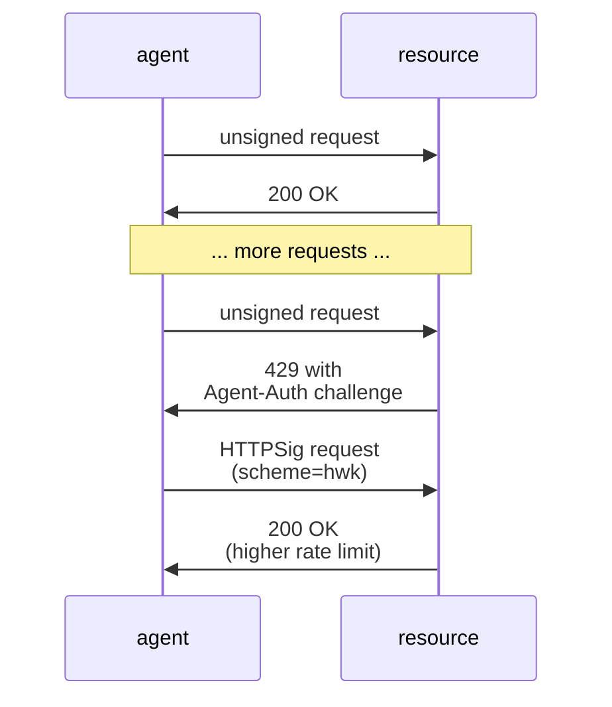
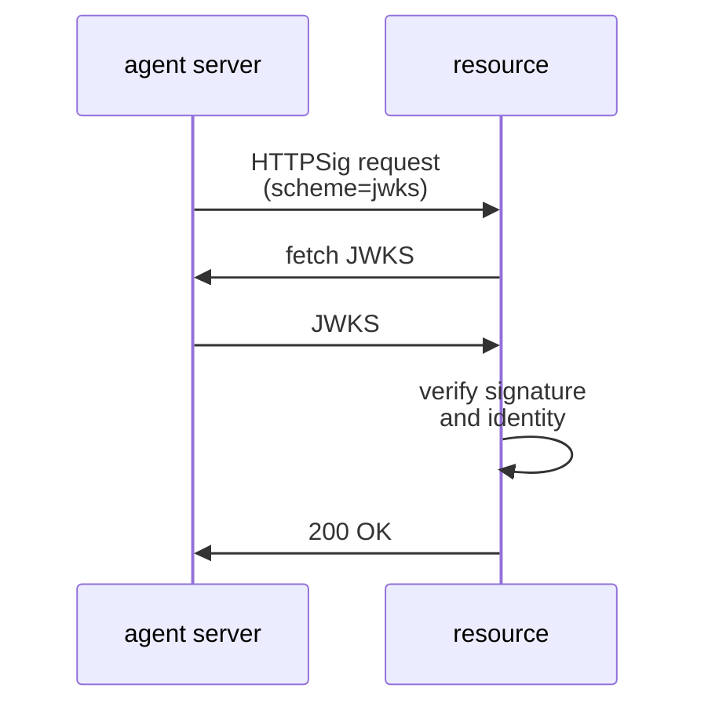
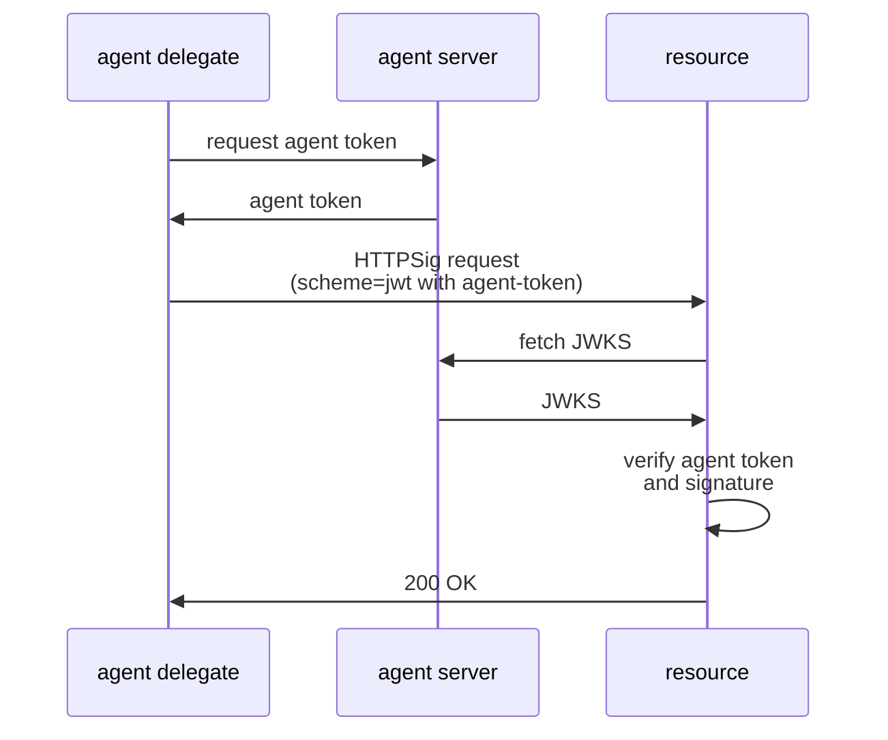
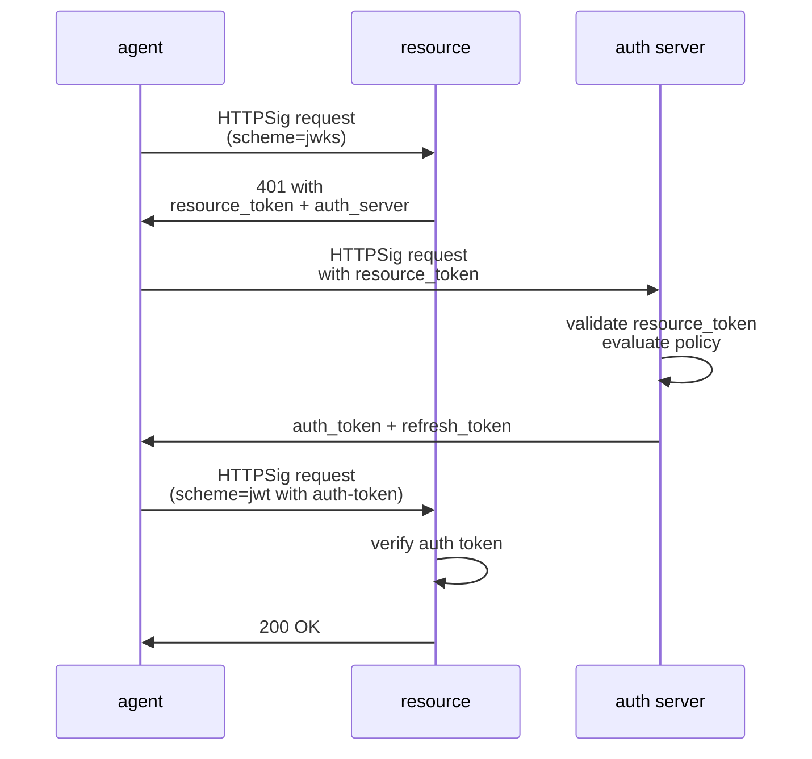
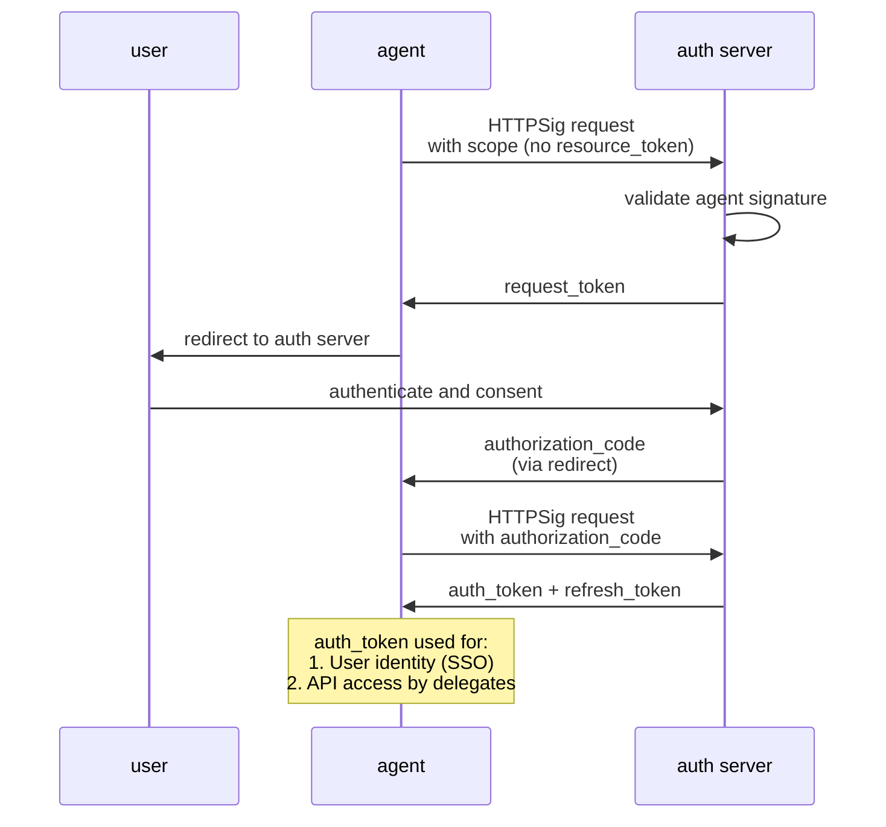
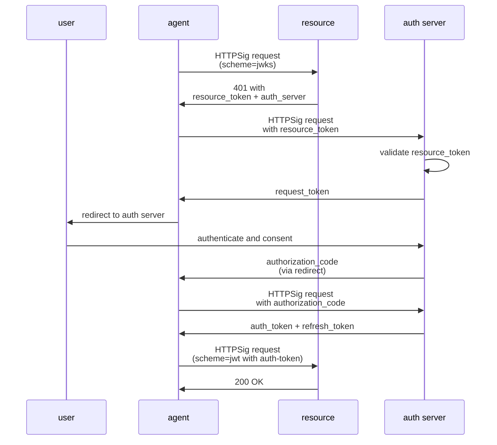
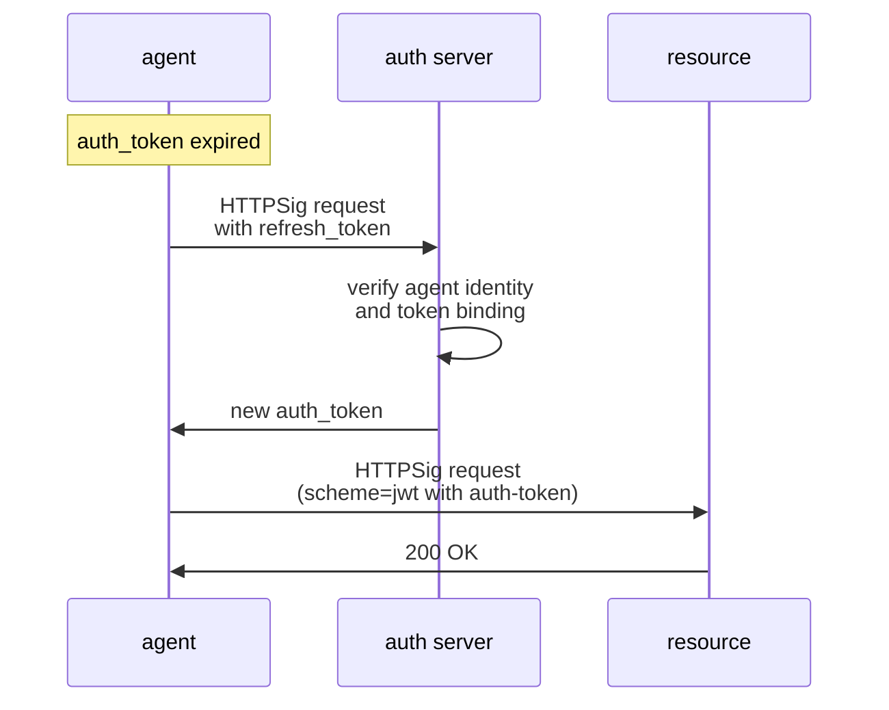
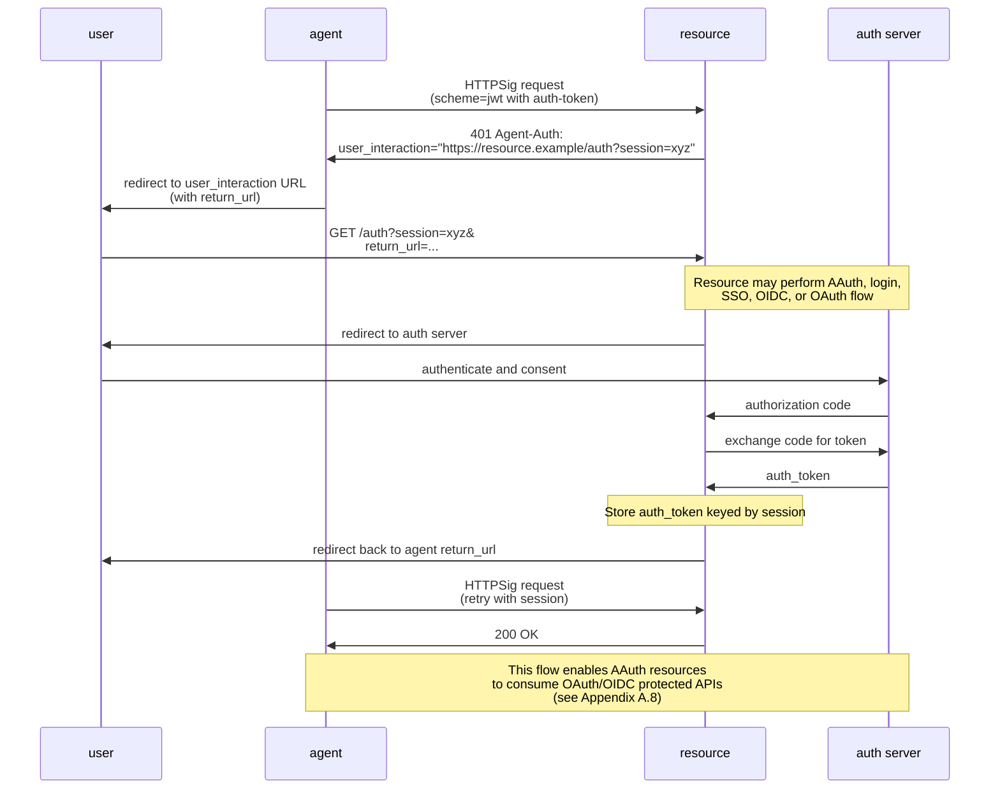
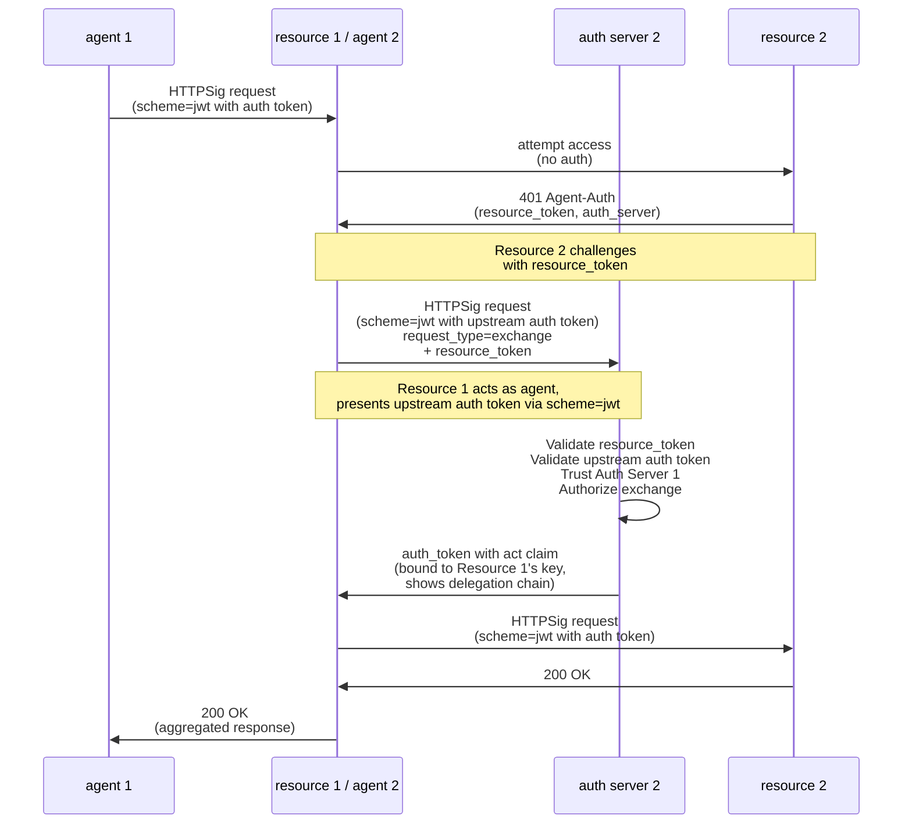
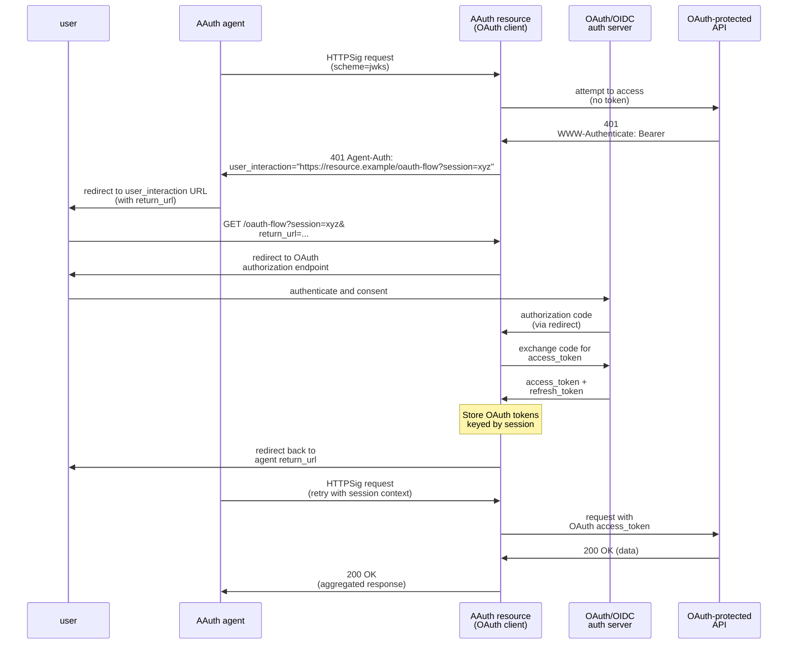

# Agent Auth (AAuth)

**Author:**
Dick Hardt
Email: dick.hardt@hello.coop

**Date:** November 21, 2025

---

## TL;DR

AAuth is an agent aware auth protocol for modern distributed systems:
- **Progressive authentication** - from abuse prevention to full authorization
- **Agent identity** - verify applications alongside users
- **Resource identity** - cryptographic proof of resource legitimacy, preventing confused deputy and MITM attacks
- **Unified protocol** - authentication and authorization in one flow
- **Dynamic ecosystems** - no pre-registration required
- **Proof-of-possession** - every request is signed, removing shared secrets
- **Multi-hop access** - resources calling resources with token exchange or downstream user interaction

---

## Preamble

**Agent Auth (AAuth)** is an exploratory specification examining what new capabilities and features may be useful to address use cases that are not well-served by existing protocols like OAuth 2.0, OpenID Connect (OIDC), and SAML. While these protocols excel in their designed use cases, the internet has evolved in ways that create gaps AAuth aims to fill.

The document explores use cases requiring capabilities beyond OAuth 2.0 and OIDC's design:
- **From bearer tokens to proof-of-possession**: Every request is cryptographically signed, eliminating bearer token exfiltration as an attack vector
- **From pre-registered client IDs to HTTPS-based agent identities**: Enabling dynamic ecosystems without registration bottlenecks
- **From implicit resource trust to provable resource identity**: Resources have cryptographic identities and issue signed resource tokens, preventing confused deputy and MITM attacks
- **From long-lived shared secrets to ephemeral keys**: Supporting distributed application instances with rapid revocation
- **From separate authentication and authorization protocols to unified auth**: Single flow provides both identity and delegated access
- **From user-only authorization to agent-aware access control**: Resources can enforce policies based on verified agent identity
- **From coarse scopes to rich authorization context**: Enabling meaningful user consent and least-privilege access
- **From single-hop to multi-hop access**: Resources often need to access downstream resources to fulfill requests. Token exchange enables access through multiple hops while maintaining proof-of-possession and user context, with interaction requests bubbling up as needed

AAuth builds on proven patterns from OAuth 2.0 (authorization code flow, refresh tokens, metadata discovery) and OIDC (identity claims, user authentication) while introducing capabilities for modern agent-based architectures.

**This is an exploration and explainer, not a ready-to-adopt draft.** The objective is to paint a picture of how modern authorization could work and spark discussion about addressing the gap between OAuth 2.0 assumptions and today's security and architectural realities.

---

## Table of Contents

1. [Introduction](#1-introduction)
2. [Terminology](#2-terminology)
3. [Protocol Overview](#3-protocol-overview)
4. [Agent-Auth Response Header](#4-agent-auth-response-header)
5. [Agent Tokens](#5-agent-tokens)
6. [Resource Tokens](#6-resource-tokens)
7. [Auth Tokens](#7-auth-tokens)
8. [Metadata Documents](#8-metadata-documents)
9. [Protocol Details](#9-protocol-details)
10. [HTTP Message Signing Profile](#10-http-message-signing-profile)
11. [Auth Request Document](#11-auth-request-document)
12. [Error Responses](#12-error-responses)
13. [Security Model](#13-security-model)
14. [IANA Considerations](#14-iana-considerations)

**Appendixes:**
- [Appendix A: Relationship to OAuth 2.1 and OIDC](#appendix-a-relationship-to-oauth-21-and-oidc)
- [Appendix B: Long Tail Agent Servers](#appendix-b-long-tail-agent-servers)
- [Appendix C: Agent Token Acquisition Patterns](#appendix-c-agent-token-acquisition-patterns)
- [Appendix D: Relationship to Web-Bot-Auth](#appendix-d-relationship-to-web-bot-auth)
- [Appendix E: Redirect Headers for Enhanced Security](#appendix-e-redirect-headers-for-enhanced-security)

---

## 1. Introduction

OAuth was created to replace the anti-pattern of users providing their passwords to applications to scrape their data from web sites. With OAuth, users could authorize an application to scoped access of their data without sharing their passwords. The internet has evolved significantly since the release of OAuth 2.0.

- **Security requirements have changed.**

  Exfiltration of bearer tokens has become a common attack vector. While proof-of-possession with digital signatures is now practical and widely supported, bearer tokens and shared secrets are still used in most deployments.

- **Applications are distributed and more diverse.**

  When OAuth 2.0 was created, the client was typically a server. Today it may also be one of many widely distributed instances of a desktop, mobile, or command line application where managing a single long lived shared secret or private key is impractical.

- **Agents have loosened the client-server model.**

  Tightly bound, pre-registered client and server relationships are giving way to more open and dynamic ecosystems. In environments like the **Model Context Protocol (MCP)**, a client may interact with *any* server, not just those it was pre-registered with.

- **Enterprise systems span multiple trust domains.**

  Organizations deploy hundreds of applications across vendors, each requiring access to resources in different security contexts. Role-based authorization is often insufficient. Fine-grained, dynamic access control often requires verifying both the calling application and user's identity.

- **OAuth scopes have become insufficient for modern authorization.**

  Traditional OAuth scopes like read or write provide only coarse-grained labels that fail to convey what data will be accessed, under what conditions, for what purpose, or for how long. This opacity prevents meaningful user consent and makes it impossible to enforce least privilege.

- **Resources have varying auth requirements.**

  Resources need different levels of protection for different operations. Public endpoints rely on IP addresses for rate limiting and abuse prevention. Application identity is verified through IP whitelisting, mTLS, or long-lived credentials. Authorization uses API keys, manually provisioned tokens, or OAuth flows—serving both user-delegated access and machine-to-machine patterns. These varying requirements have led to fragmented solutions: IP filtering for abuse, mTLS or credentials for application identity, OAuth or tokens for authorization.

- **Applications require both authentication and authorization.**

  OAuth 2.0 provides authorization (delegated access). OpenID Connect provides authentication (user identity via SSO, alongside SAML). Both protocols excel in their designed use cases: OAuth 2.0 for user-delegated API access; OIDC for browser-based SSO to web applications. However, applications often need both authentication and authorization in contexts where the separation creates friction. 

  **Resources often need access to downstream resources.**

  Modern architectures frequently require resources to call other resources to fulfill requests. When a resource needs downstream access, it must acquire authorization—sometimes autonomously based on its identity, sometimes requiring user interaction despite having no direct user interface. 

AAuth addresses these evolved requirements by redefining the relationships between three web participants:

- **Agents:** the applications and autonomous processes
- **Resources:** the protected APIs and data endpoints agents need to access
- **Auth Servers:** the systems that authenticate users and issue authorization

AAuth's protocol features directly address each trend:

- **HTTP Message Signing (HTTPSig)** ([Section 10](#10-http-message-signing-profile)) replaces bearer tokens and shared secrets. Every request an agent makes is cryptographically signed with an ephemeral key it controls, eliminating token exfiltration as an attack vector and providing verifiable proof-of-possession and message integrity when calling both an auth server and a protected resource

- **HTTPS-based agent identity and delegation** addresses distributed applications. Agents are identified by HTTPS URLs rather than pre-registered client IDs and redirect URIs. An agent identity can be used directly by an agent server (publishing metadata and keys), or delegated to agent delegates through short-lived agent tokens that bind ephemeral signing keys to the agent's identity, enabling rapid key rotation without managing long-lived shared secrets.

- **Provable resource identity** enables loose coupling between resources and auth servers while preventing confused deputy and MITM attacks. Resources are identified by HTTPS URLs and issue signed resource tokens, allowing any resource to work with any auth server without pre-registration or tight coupling.

- **Discoverable metadata** enables dynamic ecosystems. Each participant publishes a metadata document describing their capabilities and endpoints, allowing agents, resources, and auth servers to interact without pre-established relationships.

- **Verifiable application and user identity** supports multi-domain trust. Auth tokens can contain both the agent's cryptographically verified identity and user identity claims from the auth server, enabling fine-grained access control decisions based on who is requesting access and on whose behalf.

- **Extensible authorization context** goes beyond simple scopes. Resources can provide detailed authorization requests conveying what data will be accessed, under what conditions, for what purpose, and for how long. This enables meaningful user consent, fine-grained policy enforcement, and least privilege access control.

- **Progressive auth levels** allow resources to dynamically request the specific level of protection they need using the `Agent-Auth` header. A resource can challenge for signature-based proof-of-possession, verified agent identity, or authorization from the auth server—unifying IP-based abuse prevention, mTLS application identity, and OAuth authorization into a single protocol that scales with request sensitivity.

- **Unified authentication and authorization** eliminates the OAuth/OIDC split. AAuth uses "auth" to represent both authentication and authorization in a single protocol. Auth tokens can contain both identity claims and authorization scopes, giving resources everything they need for access control decisions. This eliminates confusion about when to use OAuth vs. OIDC and prevents common mistakes like misusing ID tokens for API access.

- **Multi-hop resource access** enables resources to access downstream resources to fulfill requests. The `user_interaction` mechanism allows authorization requirements to bubble up through multiple resource layers, enabling users to grant access across trust boundaries. Token exchange (`request_type=exchange`) enables autonomous multi-hop access by allowing resources to act as agents, presenting upstream auth tokens to downstream auth servers to access downstream resources without user interaction.

## 2. Terminology

### 2.1 New Definitions

- **agent**: An autonomous process or application identified by an HTTPS URL (the `agent` claim). An agent may act directly as an **agent server** or as an **agent delegate** using delegated authority from an agent server.

- **agent server**: An agent acting with its authoritative identity, using its published JWKS to sign requests directly. The agent server publishes metadata and keys at `https://agent.example/.well-known/aauth-agent` and may issue **agent tokens** to delegate its identity to agent delegates. For simplified key management for the long tail of agent servers see [Appendix B](#appendix-b-long-tail-agent-servers).

- **agent delegate**: An agent acting under delegated authority from an agent server. An agent delegate proves its identity by presenting an **agent token** (JWT) that binds its signing key to the agent server's identity. Agent delegates include server workloads (e.g., SPIFFE workloads), application installations (mobile, desktop, CLI), and device-specific deployments. 

- **agent token**: A proof-of-possession JWT issued by an agent server to an agent delegate, binding the delegate's signing key and granting it authority to act on behalf of the agent server. Presented to a resource or auth server to prove agent identity. The JWT header includes `"typ": "agent+jwt"` (media type: `application/agent+jwt`).

- **auth server**: A system identified by an HTTPS URL that authenticates the user, evaluates access requests, and issues **auth tokens** binding the agent's key to the granted access and user claims.

- **auth token**: A proof-of-possession JWT issued by the auth server to an agent, enabling access to a resource. May contain identity claims, scopes, or both. The JWT header includes `"typ": "auth+jwt"` (media type: `application/auth+jwt`).

> **auth** was chosen to indicate a new token that can represent both authn and authz.

- **request token**: An opaque string issued by the auth server representing a pending authorization request. The agent uses this token at the `agent_auth_endpoint` to initiate user consent. Similar to `request_uri` in PAR (RFC 9126) but represented as an opaque token value rather than a URI.

- **Auth Request Document**: A JSON document retrieved via HTTPS that describes detailed authorization requirements for a resource. Used for complex authorization scenarios that cannot be expressed with simple scope strings. See [Section 11](#11-auth-request-document) for details.

- **resource**: A collection of one or more protected HTTPS endpoints identified by an HTTPS URL. A resource issues **resource tokens** to bind an agent and its access request to its identity. In some cases, the resource may be the agent itself (e.g., for SSO or user authentication).

- **resource token**: A proof-of-possession JWT issued by a resource to an agent, binding the agent's identity and access request to the resource's identity. Presented to the auth server as proof of the access request's legitimacy. The JWT header includes `"typ": "resource+jwt"` (media type: `application/resource+jwt`).

- **resource metadata**: A JSON document published by a resource at `/.well-known/aauth-resource` containing the resource's configuration including its identifier, auth server, resource token endpoint, and supported capabilities.


### 2.2 Existing Definitions

The following terms are defined in existing specifications and reused in AAuth:

- **refresh token**: A credential used to obtain new access tokens without user interaction. (OAuth 2.0 [RFC 6749] Section 1.5)

- **user**: A human or organization (resource owner) whose identity and consent are represented by the auth server. (OAuth 2.0 [RFC 6749] Section 1.1)

## 3. Protocol Overview

AAuth supports progressive authentication levels: pseudonymous, identified, and authorized; allowing resources to request the appropriate level of protection for each operation using the Agent-Auth response header ([Section 4](#4-agent-auth-response-header)). The protocol involves three participants: agents (applications and autonomous processes), resources (protected APIs), and auth servers (systems that issue authorization). Agents prove their identity using HTTP Message Signatures ([Section 10](#10-http-message-signing-profile)) with agent tokens ([Section 5](#5-agent-tokens)) or auth tokens ([Section 6](#6-auth-tokens)). This section illustrates how these participants interact through common use cases.

Resources use the Agent-Auth response header to dynamically challenge agents for appropriate authentication ([Section 4](#4-agent-auth-response-header)). However, agents that already know the required scope or auth_request_url can request authorization directly from the auth server without first calling the resource. The use cases below illustrate the dynamic challenge pattern; direct authorization requests follow the same flow starting from the auth server interaction.

**Note:** The sequence diagrams in this section are simplified for clarity. Full parameter lists, validation steps, and security considerations are detailed in [Section 9 (Protocol Details)](#9-protocol-details).

### 3.1 Authentication Upgrade

A web crawler accesses public content without authentication. When rate limits are exceeded, the resource challenges for pseudonymous authentication ([Section 4](#4-agent-auth-response-header)) to grant higher limits using HTTP Message Signatures ([Section 10](#10-http-message-signing-profile)) and a header web key.



### 3.2 Agent Identity

A search engine crawler proves its identity using published JWKS ([Section 8.1](#81-agent-metadata)) to receive allowlisting and preferential rate limits.



### 3.3 Delegated Agent

A mobile app with millions of installations uses agent delegation ([Section 5](#5-agent-tokens)) so each installation has unique identity without shared secrets.



### 3.4 Autonomous Access

A data sync service copies customer records between CRM and billing systems hourly, authorized based on the service's identity (may request authorization directly if scope is pre-configured). The auth server ([Section 9.3](#93-agent-auth-request)) issues an auth token ([Section 6](#6-auth-tokens)) without user interaction.



### 3.5 Agent is Resource

An agent authenticates users to itself (agent identifier matches resource identifier) for both SSO and API access. The agent requests authorization directly with `scope` or `auth_request_url` instead of a `resource_token` ([Section 9.3](#93-agent-auth-request)). The returned auth token can be used to verify user identity and by agent delegates to call the agent's APIs, solving the OIDC limitation where ID tokens and access tokens are separate.



### 3.6 User Delegated Access

An AI assistant accesses a user's calendar data with their explicit consent through an interactive authorization flow ([Section 9.5](#95-user-consent-flow)). The auth token ([Section 6](#6-auth-tokens)) includes both user identity and authorization claims.



### 3.7 Auth Refresh

An agent maintains long-lived access by refreshing expired auth tokens ([Section 9.7](#97-auth-token-refresh)) using refresh tokens bound to its identity.



### 3.8 User Interaction Request

When a resource requires user interaction (login, SSO, or consent for downstream access) but cannot interact with the user directly, it returns a `user_interaction` URL. The agent redirects the user to this URL, the resource facilitates the required interaction with the auth server, and then redirects the user back to the agent. See [Section 9.9](#99-resource-initiated-user-interaction) for detailed protocol specification.



### 3.9 Token Exchange

When a resource needs to access a downstream resource to fulfill a request, it acts as an agent and presents the upstream auth token to the downstream auth server using `request_type=exchange`. The downstream auth server validates the upstream authorization and issues a new auth token with an `act` claim showing the delegation chain. See [Section 9.10](#910-token-exchange) for detailed protocol specification.



**Note:** For scenarios requiring user consent across multiple resources, use the `user_interaction` mechanism ([Section 9.9](#99-resource-initiated-user-interaction)) instead.

## 4. Agent-Auth Response Header

Resources use the `Agent-Auth` response header (using HTTP structured fields per RFC 8941) to indicate authentication and authorization requirements.

### 4.1. Signature Required

Requires HTTP Message Signing with any signature scheme (pseudonymous, identified, or authorized).

```
Agent-Auth: httpsig
```

**Agent response:** Include `Signature-Key` header with any scheme (scheme=hwk, scheme=jwks, scheme=x509, or scheme=jwt).

### 4.2. Identity Required

Requires agent identity verification using verifiable agent identifiers.

```
Agent-Auth: httpsig; identity=?1
```

**Agent response:** Use `scheme=jwks` or `scheme=x509` (agent server) or `scheme=jwt` with agent token (agent delegate).

**With algorithm restrictions:**
```
Agent-Auth: httpsig; identity=?1; algs=("ed25519" "rsa-pss-sha512")
```

Resources with specific algorithm requirements MAY include the `algs` parameter as an inner list. If omitted, all standard algorithms are accepted.

### 4.3. Authorization Required

Requires authorization from an auth server. The resource issues a resource token and returns it with the auth server identifier.

```
Agent-Auth: httpsig; auth-token; resource_token="eyJhbGciOiJFZERTQSIsInR5cCI6InJlc291cmNlK2p3dCIsImtpZCI6InJlc291cmNlLWtleS0xIn0.eyJpc3MiOiJodHRwczovL3Jlc291cmNlLmV4YW1wbGUiLCJhdWQiOiJodHRwczovL2F1dGguZXhhbXBsZSIsImFnZW50IjoiaHR0cHM6Ly9hZ2VudC5leGFtcGxlIiwiYWdlbnRfamt0IjoiTnpiTHNYaDh1RENjZC02TU53WEY0V183bm9XWEZaQWZIa3hac1JHQzlYcyIsImV4cCI6MTczMDIyMTIwMCwic2NvcGUiOiJkYXRhLnJlYWQgZGF0YS53cml0ZSJ9.signature"; auth_server="https://auth.example"
```

**Agent response:** Present the resource token to the specified auth server to obtain an auth token ([Section 6](#6-resource-tokens)), then retry request with `scheme=jwt` and the auth token.

### 4.4. User Interaction Required

When a resource requires user interaction (login, consent, or OAuth flow), it returns a `user_interaction` URL where the agent should direct the user.

```
Agent-Auth: httpsig; user_interaction="https://resource.example/auth?session=xyz"
```

**With downstream resource parameters:**
```
Agent-Auth: httpsig; user_interaction="https://resource.example/auth?session=xyz"; resource_token="eyJhbGc..."; auth_server="https://auth.example"
```

**Agent response:** Direct the user to the `user_interaction` URL with a `return_url` parameter, wait for the user to complete the interaction, then retry the original request. See [Section 9.9](#99-resource-initiated-user-interaction) for details.

### 4.5. Status Codes and Progressive Rate Limiting

While `Agent-Auth` is typically used with **401 Unauthorized**, resources **MAY** use it with other status codes to enable progressive rate limiting and abuse mitigation based on authentication level.

**401 Unauthorized** - Authentication required

Used when the current authentication level is insufficient:

```http
HTTP/1.1 401 Unauthorized
Agent-Auth: httpsig; identity=?1
```

**429 Too Many Requests** - Rate limit exceeded

Used when the agent has exceeded rate limits for their current authentication level, but a higher authentication level would have higher limits:

```http
HTTP/1.1 429 Too Many Requests
Agent-Auth: httpsig; identity=?1
Retry-After: 60
```

**Example progressive rate limiting:**
- Pseudonymous (scheme=hwk): 10 requests/minute
- Identified (scheme=jwks, scheme=x509, or scheme=jwt with agent-token): 100 requests/minute
- Authorized (scheme=jwt with auth-token): 1000 requests/minute

**403 Forbidden** - Access denied for current authentication level

Used when the agent is blocked or access is denied at the current authentication level, but a higher level might be accepted:

```http
HTTP/1.1 403 Forbidden
Agent-Auth: httpsig; auth-token; resource_token="eyJhbGc..."; auth_server="https://auth.example"
```

This allows resources to block abusive pseudonymous traffic while still accepting identified or authorized requests from the same origin.

### 4.6. Parameters

**Agent-Auth header parameters:**
- `httpsig`: Authentication scheme (REQUIRED for all responses)
- `identity`: Boolean parameter (?1 = true) indicating agent identity is required
- `auth-token`: Bare token indicating authorization is required
- `resource_token`: String parameter containing a signed JWT issued by the resource ([Section 6](#6-resource-tokens)) that binds the agent and access request to the resource's identity
- `auth_server`: String parameter with the HTTPS URL of the authorization server ([Section 9.3](#93-agent-auth-request))
- `user_interaction`: String parameter with URL where the agent should direct the user for interaction ([Section 9.9](#99-resource-initiated-user-interaction))
- `algs`: Inner list of supported HTTPSig algorithms ([Section 10](#10-http-message-signing-profile))

### 4.7. Compatibility with WWW-Authenticate

Resources **MAY** include both `Agent-Auth` and `WWW-Authenticate` headers to support multiple authentication protocols:

```http
HTTP/1.1 401 Unauthorized
Agent-Auth: httpsig; auth-token; resource_token="eyJhbGc..."
WWW-Authenticate: Bearer realm="resource.example", scope="data.read"
```

## 5. Agent Tokens

Agent tokens enable agent delegates to prove delegated identity from an agent server. This section describes the token format, claims, and acquisition process.

### 5.1. Purpose

Agent tokens enable identity delegation by binding an agent delegate's signing key to the agent server's authoritative identity. An agent server and agent delegate share the same agent identifier (the `agent` claim), but prove that identity differently:

- **Agent server**: Uses published JWKS directly (no agent token needed)
- **Agent delegate**: Presents an agent token signed by the agent server

This delegation model enables distributed application instances to share a single agent identity while using ephemeral keys that can rotate frequently without affecting refresh tokens (see [Section 5.6](#56-token-acquisition)).

### 5.2. Token Format

Agent tokens **MUST** be signed JWTs using the JWS Compact Serialization format.

The JOSE header **MUST** include:
- `typ` (REQUIRED): **MUST** be `"agent+jwt"` (media type: `application/agent+jwt`)
- `alg` (REQUIRED): Signature algorithm from the agent server's JWKS
- `kid` (REQUIRED): Key ID identifying the signing key in the agent server's JWKS

### 5.3. Required Claims

- `iss` (REQUIRED): The agent server's HTTPS URL (also the agent identifier)
- `sub` (REQUIRED): Agent delegate identifier. Identifies the delegated workload or installation, not the specific instance. Examples:
  - Server workload: `spiffe://trust-domain/service/api`
  - Mobile app installation: `app-installation-uuid-xyz`
  - Desktop app installation: `desktop-app-install-abc`
  - This identifier persists across restarts and key rotations
- `exp` (REQUIRED): Expiration timestamp (Unix time)
- `cnf` (REQUIRED): Confirmation object containing:
  - `jwk` (REQUIRED): JSON Web Key - the agent delegate's public signing key

### 5.4. Optional Claims

- `aud` (OPTIONAL): Intended audience(s) - restricts which resources or auth servers can accept this agent token. May be a string (single audience) or an array of strings (multiple audiences)
- Additional claims: Agent servers **MAY** include custom claims for delegation policies (future work)

### 5.5. Example Agent Token

**JOSE Header:**
```json
{
  "typ": "agent+jwt",
  "alg": "EdDSA",
  "kid": "agent-server-key-1"
}
```

**Payload:**
```json
{
  "iss": "https://agent.example",
  "sub": "spiffe://example.com/workload/api-service",
  "exp": 1730218200,
  "cnf": {
    "jwk": {
      "kty": "OKP",
      "crv": "Ed25519",
      "x": "11qYAYKxCrfVS_7TyWQHOg7hcvPapiMlrwIaaPcHURo"
    }
  }
}
```

### 5.6. Token Acquisition

Agent delegates obtain agent tokens from their agent server. The specifics of this interaction are **out of scope** for this specification and may vary based on deployment needs. For common patterns and examples, see [Appendix C: Agent Token Acquisition Patterns](#appendix-c-agent-token-acquisition-patterns).

**Key management options:**

Agent delegates **SHOULD** rotate keys frequently. Two common approaches:

- **Ephemeral keys** (recommended for simplicity): Generate fresh key pair at startup, keep in memory only. When delegate restarts, generate new key and request new agent token with same `sub`. Eliminates need for secure key storage.

- **Persisted keys**: Store key securely, rotate based on policy (time-based, event-based, etc.). Request new agent token after rotation with same `sub`.

In both cases, the new agent token uses the same `sub` (agent delegate identifier), allowing refresh tokens to remain valid across key rotations.

**Security considerations:**

- Agent servers **SHOULD** issue short-lived tokens to enable frequent key rotation
- Agent servers **SHOULD** track issued tokens by `sub` for delegation management
- Agent servers **MAY** require additional authentication or authorization before issuing tokens
- Agent delegates **SHOULD** request new agent tokens before expiration to maintain service continuity
- Agent delegates using persisted keys **MUST** store private keys securely

### 5.7. Validation by Resources and Auth Servers

When an agent presents `Signature-Key: sig=(scheme=jwt jwt="<agent-token>")`, the recipient **MUST** validate:

1. Parse the JWT and extract the JOSE header
2. Verify `typ` is `"agent+jwt"`
3. Extract `kid` from the JOSE header
4. Extract `iss` (agent) from the payload
5. Fetch the agent server's JWKS (from metadata at `iss`)
6. Match the signing key by `kid`
7. Verify the JWT signature using the matched public key
8. Verify the `exp` claim (current time **MUST** be less than expiration)
9. Verify the `sub` claim is present (agent delegate identifier)
10. If `aud` claim is present, verify the recipient's identifier is included in the audience
11. Extract the public key from `cnf.jwk`
12. Verify that the HTTPSig request signature was created with the key from `cnf.jwk`

## 6. Resource Tokens

Resource tokens enable resources to prove their identity and bind access requests to specific agents. This section describes the token format, claims, and validation process.

### 6.1. Purpose

Resource tokens provide cryptographic proof of resource identity and bind access requests to both the requesting agent and the resource's identity. This prevents several attack scenarios:

- **Confused deputy prevention**: The `agent` claim binds the request to a specific agent, preventing an attacker from substituting a different resource in the authorization flow
- **MITM prevention**: The resource's signature proves authenticity, preventing attackers from impersonating the resource
- **Request integrity**: The `agent_jkt` (JWK Thumbprint) binds the request to the agent's current signing key, preventing token reuse with different keys

Auth servers verify resource tokens to confirm that legitimate resources are making authorization requests for specific agents.

### 6.2. Token Format

Resource tokens **MUST** be signed JWTs using the JWS Compact Serialization format.

The JOSE header **MUST** include:
- `typ` (REQUIRED): **MUST** be `"resource+jwt"` (media type: `application/resource+jwt`)
- `alg` (REQUIRED): Signature algorithm from the resource's JWKS
- `kid` (REQUIRED): Key ID identifying the signing key in the resource's JWKS

> Encryption of resource tokens may be specified in a future version of this specification.

### 6.3. Required Claims

- `iss` (REQUIRED): The resource's HTTPS URL identifier
- `aud` (REQUIRED): The auth server's HTTPS URL identifier
- `agent` (REQUIRED): The requesting agent's HTTPS URL identifier
- `agent_jkt` (REQUIRED): JWK Thumbprint of the agent's current signing key, calculated per RFC 7638 as BASE64URL(SHA-256(canonical JWK))
- `exp` (REQUIRED): Expiration timestamp (Unix time)
- One of the following (REQUIRED):
  - `scope` (string): Space-separated scope values for the access request
  - `auth_request_url` (string): HTTPS URL to an Auth Request Document for complex authorization

### 6.4. Example Resource Token

**JOSE Header:**
```json
{
  "typ": "resource+jwt",
  "alg": "EdDSA",
  "kid": "resource-key-1"
}
```

**Payload:**
```json
{
  "iss": "https://resource.example",
  "aud": "https://auth.example",
  "agent": "https://agent.example",
  "agent_jkt": "NzbLsXh8uDCcd-6MNwXF4W_7noWXFZAfHkxZsRGC9Xs",
  "exp": 1730221200,
  "scope": "data.read data.write"
}
```

### 6.5. Validation by Auth Servers

When an agent presents a resource token, the auth server **MUST** validate:

1. Parse the JWT and extract the JOSE header
2. Verify `typ` is `"resource+jwt"`
3. Extract `kid` from the JOSE header
4. Extract `iss` (resource identifier) from the payload
5. Fetch the resource's metadata from `{iss}/.well-known/aauth-resource`
6. Extract `jwks_uri` from the metadata
7. Fetch the resource's JWKS from `jwks_uri`
8. Match the signing key by `kid`
9. Verify the JWT signature using the matched public key
10. Verify `aud` matches the auth server's identifier
11. Verify `agent` matches the requesting agent's identifier
12. Verify `agent_jkt` matches the JWK Thumbprint of the agent's current signing key
13. Verify `exp` claim (current time **MUST** be less than expiration)
14. Extract and process the `scope` or `auth_request_url` for authorization evaluation

## 7. Auth Tokens

Auth tokens are proof-of-possession JWTs issued by auth servers that authorize agents to access specific resources. This section describes the token format and claims.

### 7.1. Purpose

Auth tokens bind together:
- **Agent identity**: Which agent is authorized (via `agent`)
- **Agent key**: The agent's signing key (via `cnf.jwk`)
- **Resource**: What the agent can access (via `aud`)
- **Authorization**: What the agent can do (via `scope` or other claims)
- **User identity**: Optionally, on whose behalf (via `sub` and identity claims)

### 7.2. Token Format

Auth tokens **MUST** be signed JWTs using the JWS Compact Serialization format. Auth tokens **MAY** optionally be encrypted using JWE (JSON Web Encryption) to preserve privacy of token contents from the agent.

**Signed (unencrypted) auth tokens:**

The JOSE header **MUST** include:
- `typ` (REQUIRED): **MUST** be `"auth+jwt"` (media type: `application/auth+jwt`)
- `alg` (REQUIRED): Signature algorithm from the auth server's JWKS
- `kid` (REQUIRED): Key ID identifying the signing key in the auth server's JWKS

**Encrypted auth tokens:**

When a resource provides an encryption public key in an Auth Request Document ([Section 11](#11-auth-request-document)), the auth server **MAY** issue an encrypted auth token to preserve the privacy of token contents from the agent. The token is first signed as a JWS, then encrypted as a JWE using the resource's encryption public key.

The JWE header **MUST** include:
- `typ` (REQUIRED): **MUST** be `"auth+jwt"` (media type: `application/auth+jwt`)
- `alg` (REQUIRED): Key encryption algorithm (e.g., `ECDH-ES+A256KW`, `RSA-OAEP-256`)
- `enc` (REQUIRED): Content encryption algorithm (e.g., `A256GCM`)
- `kid` (OPTIONAL): Key ID for the resource's encryption key (if provided in Auth Request Document)

The encrypted payload is the signed JWT (JWS). Only the resource possessing the corresponding private key can decrypt and validate the auth token. The agent treats the encrypted token as opaque and presents it to the resource via the `Signature-Key` header.

### 7.3. Required Claims

- `iss` (REQUIRED): The auth server's HTTPS URL
- `aud` (REQUIRED): The resource identifier this token authorizes access to
- `agent` (REQUIRED if `aud` is not the agent identifier): The agent's HTTPS URL (from agent identity). When the agent uses the auth server for SSO (Single Sign-On) to authenticate users to itself, `aud` is the agent identifier and this claim is omitted.
- `exp` (REQUIRED): Expiration time (Unix timestamp)
- `cnf` (REQUIRED): Confirmation claim object containing:
  - `jwk` (REQUIRED): JSON Web Key - the agent's public signing key (copied from agent token or agent JWKS)

### 7.4. Optional Claims

- `agent_delegate` (OPTIONAL): Agent delegate identifier - present when the agent uses delegation (copied from agent token's `sub`)
- `scope` (OPTIONAL): Space-separated authorized scopes (excludes identity scopes like `openid`, `profile`, `email` which control token claims rather than resource access)
- `act` (OPTIONAL): Actor claim showing the delegation chain in token exchange scenarios. Contains information about the upstream agent that delegated access. See [Section 9.10](#910-token-exchange) for details on token exchange and the `act` claim structure.
- **User identity claims** (when `openid` scope was requested):
  - `sub` (REQUIRED if openid scope granted): User identifier
  - `name` (OPTIONAL): User's full name
  - `email` (OPTIONAL): User's email address
  - `email_verified` (OPTIONAL): Email verification status (boolean)
  - Additional standard claims per OpenID Connect Core 1.0 Section 5.1

### 7.5. Example Auth Token (User Authorization)

**JOSE Header:**
```json
{
  "typ": "auth+jwt",
  "alg": "EdDSA",
  "kid": "auth-server-key-1"
}
```

**Payload:**
```json
{
  "iss": "https://auth.example",
  "agent": "https://agent.example",
  "agent_delegate": "mobile-app-install-xyz",
  "aud": "https://resource.example",
  "exp": 1730221200,
  "scope": "data.read data.write",
  "cnf": {
    "jwk": {
      "kty": "OKP",
      "crv": "Ed25519",
      "x": "11qYAYKxCrfVS_7TyWQHOg7hcvPapiMlrwIaaPcHURo"
    }
  },
  "sub": "user-12345",
  "name": "Alice Smith",
  "email": "alice@example.com",
  "email_verified": true
}
```

### 7.6. Example Auth Token (Autonomous Agent)

**Payload:**
```json
{
  "iss": "https://auth.example",
  "agent": "https://agent.example",
  "agent_delegate": "spiffe://example.com/workload/api-service",
  "aud": "https://resource.example",
  "exp": 1730221200,
  "scope": "data.read",
  "cnf": {
    "jwk": {
      "kty": "OKP",
      "crv": "Ed25519",
      "x": "11qYAYKxCrfVS_7TyWQHOg7hcvPapiMlrwIaaPcHURo"
    }
  }
}
```

### 7.7. Validation by Resources

When an agent presents `Signature-Key: sig=(scheme=jwt jwt="<auth-token>")`, the resource **MUST** validate:

**For encrypted auth tokens (JWE format):**

1. Parse the token and extract the JOSE header
2. Verify `typ` is `"auth+jwt"`
3. Identify that the token is encrypted (header contains `alg` for key encryption and `enc` for content encryption)
4. Decrypt the JWE using the resource's private encryption key
5. Extract the decrypted JWT (JWS) from the JWE payload
6. Continue with validation steps for signed tokens below

**For signed auth tokens (JWS format) or after decrypting JWE:**

1. Parse the JWT and extract the JOSE header
2. Verify `typ` is `"auth+jwt"`
3. Extract `kid` from the JOSE header
4. Extract `iss` from the payload
5. Fetch the auth server's JWKS (from metadata)
6. Match the signing key by `kid`
7. Verify the JWT signature using the matched public key
8. Verify the `exp` claim (current time **MUST** be less than expiration)
9. Verify the `iss` matches the trusted auth server
10. Verify the `aud` matches the resource identifier being accessed
11. Verify the `agent` claim is present
12. Extract the public key from `cnf.jwk`
13. Verify that the HTTPSig request signature was created with the key from `cnf.jwk`
14. Verify the `scope` claim (if present) authorizes the requested operation
15. Optionally enforce policies based on `agent`, `agent_delegate`, or `sub` (user)

## 8. Metadata Documents

Metadata documents enable dynamic discovery of endpoints, capabilities, and keys. This section describes the metadata published by each participant type.

### 8.1. Agent Metadata

Agent servers **MUST** publish metadata at `/.well-known/aauth-agent`.

**Required fields:**

- `agent` (string): The agent's HTTPS URL
- `jwks_uri` (string): URL to the agent's JSON Web Key Set

**Required fields if agent requests user authorization:**

- `redirect_uris` (array of strings): Valid redirect URIs for authorization callbacks
- `name` (string): Human-readable agent name
- `logo_uri` (string): URL to agent logo
- `policy_uri` (string): URL to privacy policy
- `tos_uri` (string): URL to terms of service
- `homepage` (string): Agent homepage URL

**Example:**
```json
{
  "agent": "https://agent.example",
  "jwks_uri": "https://agent.example/jwks.json",
  "redirect_uris": [
    "https://agent.example/callback",
    "https://agent.example/aauth/callback"
  ],
  "name": "Example Agent",
  "logo_uri": "https://agent.example/logo.png",
  "policy_uri": "https://agent.example/privacy",
  "tos_uri": "https://agent.example/tos",
  "homepage": "https://agent.example"
}
```

### 8.2. Auth Server Metadata

Auth servers **MUST** publish metadata at `/.well-known/aauth-issuer`.

**Required fields:**

- `issuer` (string): The auth server's HTTPS URL
- `jwks_uri` (string): URL to the auth server's JSON Web Key Set
- `agent_token_endpoint` (string): Endpoint for auth requests, code exchange, token exchange, and refresh
- `agent_auth_endpoint` (string): Endpoint for user authentication and consent flow
- `agent_signing_algs_supported` (array): Supported HTTPSig algorithms
- `request_types_supported` (array): Supported request_type values (e.g., `["auth", "code", "exchange", "refresh"]`)

**Optional fields:**

- `scopes_supported` (array): Supported scopes

**Example:**
```json
{
  "issuer": "https://auth.example",
  "jwks_uri": "https://auth.example/jwks.json",
  "agent_token_endpoint": "https://auth.example/agent/token",
  "agent_auth_endpoint": "https://auth.example/agent/auth",
  "agent_signing_algs_supported": [
    "ed25519",
    "rsa-pss-sha512"
  ],
  "request_types_supported": [
    "auth",
    "code",
    "exchange",
    "refresh"
  ],
  "scopes_supported": [
    "profile",
    "email",
    "data.read",
    "data.write"
  ]
}
```

### 8.3. Resource Metadata

Resources **MUST** publish metadata at `/.well-known/aauth-resource`.

**Required fields:**

- `resource` (string): The resource's HTTPS URL
- `jwks_uri` (string): URL to the resource's JSON Web Key Set
- `resource_token_endpoint` (string): Endpoint where agents request resource tokens

**Optional fields:**

- `supported_scopes` (array of strings): List of scope values supported by this resource
- `scope_descriptions` (object): Dictionary mapping scope names to human-readable descriptions. Enables auth servers to display meaningful consent information to users without tight coupling between resource and auth server.

**Example:**
```json
{
  "resource": "https://resource.example",
  "jwks_uri": "https://resource.example/jwks.json",
  "resource_token_endpoint": "https://resource.example/resource/token",
  "supported_scopes": ["data.read", "data.write", "data.delete"],
  "scope_descriptions": {
    "data.read": "Read access to your data and documents",
    "data.write": "Create and update your data and documents",
    "data.delete": "Permanently delete your data and documents"
  }
}
```

## 9. Protocol Details

This section describes each step in the protocol flow in detail.

### 9.1. Resource Request

The agent makes a signed request to the resource including the `Signature-Key` header.

**Example pseudonymous request:**
```http
GET /api/data HTTP/1.1
Host: resource.example
Signature-Input: sig=("@method" "@authority" "@path" "signature-key");created=1730217600
Signature: sig=:...signature bytes...:
Signature-Key: sig=(scheme=hwk kty="OKP" crv="Ed25519" x="JrQLj5P...")
```

**Example identified request (agent delegate):**
```http
GET /api/data HTTP/1.1
Host: resource.example
Signature-Input: sig=("@method" "@authority" "@path" "signature-key");created=1730217600
Signature: sig=:...signature bytes...:
Signature-Key: sig=(scheme=jwt jwt="eyJhbGc...")
```

**Example authorized request:**
```http
GET /api/data HTTP/1.1
Host: resource.example
Signature-Input: sig=("@method" "@authority" "@path" "signature-key");created=1730217600
Signature: sig=:...signature bytes...:
Signature-Key: sig=(scheme=jwt jwt="eyJhbGc...")
```

### 9.2. Agent-Auth Challenge

If the resource requires a higher authentication level than provided, it responds with a 401 status and an `Agent-Auth` header.

**Example: Signature required**
```http
HTTP/1.1 401 Unauthorized
Agent-Auth: httpsig
```

**Example: Identity required**
```http
HTTP/1.1 401 Unauthorized
Agent-Auth: httpsig; identity=?1
```

**Example: Authorization required**
```http
HTTP/1.1 401 Unauthorized
Agent-Auth: httpsig; auth-token; resource_token="eyJhbGciOiJFZERTQSIsInR5cCI6InJlc291cmNlK2p3dCIsImtpZCI6InJlc291cmNlLWtleS0xIn0.eyJpc3MiOiJodHRwczovL3Jlc291cmNlLmV4YW1wbGUiLCJhdWQiOiJodHRwczovL2F1dGguZXhhbXBsZSIsImFnZW50IjoiaHR0cHM6Ly9hZ2VudC5leGFtcGxlIiwiYWdlbnRfamt0IjoiTnpiTHNYaDh1RENjZC02TU53WEY0V183bm9XWEZaQWZIa3hac1JHQzlYcyIsImV4cCI6MTczMDIyMTIwMCwic2NvcGUiOiJkYXRhLnJlYWQgZGF0YS53cml0ZSJ9.signature"; auth_server="https://auth.example"
```

### 9.2.5. Resource Token Endpoint

When an agent knows the required scope or auth_request_url upfront (without first calling the protected resource), it can request a resource token directly from the resource's `resource_token_endpoint`.

**Request:**

The agent makes a signed POST request to the resource's `resource_token_endpoint` (discovered from resource metadata at `/.well-known/aauth-resource`).

**Request parameters:**

- `scope` (CONDITIONAL): Space-separated scope values (REQUIRED if `auth_request_url` is not provided)
- `auth_request_url` (CONDITIONAL): HTTPS URL to an Auth Request Document (REQUIRED if `scope` is not provided)

**Example request:**
```http
POST /resource/token HTTP/1.1
Host: resource.example
Content-Type: application/x-www-form-urlencoded
Content-Digest: sha-256=:X48E9qOokqqrvdts8nOJRJN3OWDUoyWxBf7kbu9DBPE=:
Signature-Input: sig=("@method" "@authority" "@path" "content-type" "content-digest" "signature-key");created=1730217600
Signature: sig=:...signature bytes...:
Signature-Key: sig=(scheme=jwks id="https://agent.example" kid="key-1")

scope=data.read+data.write
```

**Response:**

The resource validates the agent's signature, creates a resource token binding the agent and access request to its identity, and returns it with the auth server identifier.

**Response parameters:**

- `resource_token` (REQUIRED): The signed resource token (JWT)
- `auth_server` (REQUIRED): The HTTPS URL of the authorization server
- `expires_in` (OPTIONAL): Lifetime in seconds of the resource token

**Example response:**
```http
HTTP/1.1 200 OK
Content-Type: application/json

{
  "resource_token": "eyJhbGciOiJFZERTQSIsInR5cCI6InJlc291cmNlK2p3dCIsImtpZCI6InJlc291cmNlLWtleS0xIn0.eyJpc3MiOiJodHRwczovL3Jlc291cmNlLmV4YW1wbGUiLCJhdWQiOiJodHRwczovL2F1dGguZXhhbXBsZSIsImFnZW50IjoiaHR0cHM6Ly9hZ2VudC5leGFtcGxlIiwiYWdlbnRfamt0IjoiTnpiTHNYaDh1RENjZC02TU53WEY0V183bm9XWEZaQWZIa3hac1JHQzlYcyIsImV4cCI6MTczMDIyMTIwMCwic2NvcGUiOiJkYXRhLnJlYWQgZGF0YS53cml0ZSJ9.signature",
  "auth_server": "https://auth.example",
  "expires_in": 300
}
```

### 9.3. Agent Auth Request

The agent makes a signed request to the auth server's `agent_token_endpoint` with `request_type=auth`.

**Request parameters:**

- `request_type` (REQUIRED): Must be `auth`
- Exactly one of the following (REQUIRED):
  - `resource_token` (string): The resource token obtained from a resource's Agent-Auth challenge or resource_token_endpoint. Used when requesting access to another resource.
  - `scope` (string): Space-separated scope values. Used when the agent requests authorization to itself (agent identifier matches resource identifier) for simpler access requirements.
  - `auth_request_url` (string): HTTPS URL to an Auth Request Document. Used when the agent requests authorization to itself (agent identifier matches resource identifier) for complex access requirements.
- `redirect_uri` (REQUIRED): The callback URI for authorization code

**Usage:**

When an agent accesses **another resource**, it obtains a `resource_token` from that resource and presents it to the auth server. The resource token cryptographically binds the agent, resource, and access request.

When an agent requests authorization **to itself** (agent identifier matches resource identifier), it provides `scope` or `auth_request_url` directly. This pattern supports user authentication (SSO) and delegated API access. The returned auth token can be used both to verify user identity and by agent delegates to call the agent's APIs, solving the OIDC limitation where ID tokens and access tokens are separate. In this case, a resource token is unnecessary since the agent's HTTPSig signature already proves its identity.

**Example request with resource_token:**
```http
POST /agent/token HTTP/1.1
Host: auth.example
Content-Type: application/x-www-form-urlencoded
Content-Digest: sha-256=:X48E9qOokqqrvdts8nOJRJN3OWDUoyWxBf7kbu9DBPE=:
Signature-Input: sig=("@method" "@authority" "@path" "content-type" "content-digest" "signature-key");created=1730217600
Signature: sig=:...signature bytes...:
Signature-Key: sig=(scheme=jwt jwt="eyJhbGc...")

request_type=auth& \
resource_token=eyJhbGciOiJFZERTQSIsInR5cCI6InJlc291cmNlK2p3dCIsImtpZCI6InJlc291cmNlLWtleS0xIn0.eyJpc3MiOiJodHRwczovL3Jlc291cmNlLmV4YW1wbGUiLCJhdWQiOiJodHRwczovL2F1dGguZXhhbXBsZSIsImFnZW50IjoiaHR0cHM6Ly9hZ2VudC5leGFtcGxlIiwiYWdlbnRfamt0IjoiTnpiTHNYaDh1RENjZC02TU53WEY0V183bm9XWEZaQWZIa3hac1JHQzlYcyIsImV4cCI6MTczMDIyMTIwMCwic2NvcGUiOiJkYXRhLnJlYWQgZGF0YS53cml0ZSJ9.signature& \
redirect_uri=https://agent.example/callback
```

**Example request with scope (agent as resource):**
```http
POST /agent/token HTTP/1.1
Host: auth.example
Content-Type: application/x-www-form-urlencoded
Content-Digest: sha-256=:X48E9qOokqqrvdts8nOJRJN3OWDUoyWxBf7kbu9DBPE=:
Signature-Input: sig=("@method" "@authority" "@path" "content-type" "content-digest" "signature-key");created=1730217600
Signature: sig=:...signature bytes...:
Signature-Key: sig=(scheme=jwks id="https://agent.example" kid="key-1")

request_type=auth& \
scope=profile+email& \
redirect_uri=https://agent.example/callback
```

### 9.4. Auth Response

The auth server validates the request and responds based on policy.

**Validation:**

If `resource_token` was provided, the auth server **MUST** validate it ([Section 6.5](#65-validation-by-auth-servers)):
1. Verify the JWT signature using the resource's JWKS
2. Verify the `aud` claim matches the auth server's identifier
3. Verify the `agent` claim matches the requesting agent's identifier
4. Verify the `agent_jkt` matches the JWK Thumbprint of the agent's current signing key
5. Verify the token is not expired
6. Extract the `scope` or `auth_request_url` from the token for authorization evaluation

If `scope` or `auth_request_url` was provided directly (agent as resource), the auth server **MUST**:
1. Verify the agent's HTTPSig signature proves the agent's identity
2. Use the provided `scope` or `auth_request_url` directly for authorization evaluation
3. Verify the agent identifier is appropriate as the resource identifier for the requested access

**Response:**

**Direct grant response:**
```http
HTTP/1.1 200 OK
Content-Type: application/json

{
  "auth_token": "eyJhbGc...",
  "expires_in": 3600,
  "refresh_token": "eyJhbGc..."
}
```

**User consent required response:**
```http
HTTP/1.1 200 OK
Content-Type: application/json

{
  "request_token": "eyJhbGciOiJub25lIn0.eyJleHAiOjE3MzAyMTgyMDB9.",
  "expires_in": 600
}
```

The `request_token` is an opaque value representing the pending auth request. The agent uses this at the `agent_auth_endpoint` to redirect the user for authentication and consent.

### 9.5. User Consent Flow

If the auth server responds with a `request_token` (indicating user consent is required), the agent directs the user to the `agent_auth_endpoint` for authentication and authorization.

**Flow:**

1. **Agent receives request_token**: After making an auth request ([Section 9.3](#93-agent-auth-request)), the auth server responds with:
   ```json
   {
     "request_token": "eyJhbGciOiJub25lIn0.eyJleHAiOjE3MzAyMTgyMDB9."
   }
   ```

2. **Agent redirects user**: The agent redirects the user to the `agent_auth_endpoint` from auth server metadata ([Section 8.2](#82-auth-server-metadata)), including the `request_token` and a `redirect_uri` for callback:
   ```
   https://auth.example/agent/auth?request_token=eyJhbGciOiJub25lIn0.eyJleHAiOjE3MzAyMTgyMDB9.&redirect_uri=https://agent.example/callback
   ```

3. **User authenticates and consents**: At the auth server:
   - User authenticates (if not already authenticated)
   - Auth server displays the authorization request details (resource, scopes, agent identity)
   - User reviews and grants or denies consent
   - Auth server generates an authorization code bound to the request_token and redirect_uri

4. **Auth server redirects back**: The auth server redirects the user back to the agent's `redirect_uri`:
   ```http
   HTTP/1.1 303 See Other
   Location: https://agent.example/callback?code=SplxlOBeZQQYbYS6WxSbIA
   ```

5. **Agent exchanges code for tokens**: The agent makes an HTTPSig request to the `agent_token_endpoint` ([Section 9.6](#96-auth-token-request)) with the authorization code:
   ```http
   POST /agent/token HTTP/1.1
   Host: auth.example
   Content-Type: application/x-www-form-urlencoded
   Content-Digest: sha-256=:X48E9qOokqqrvdts8nOJRJN3OWDUoyWxBf7kbu9DBPE=:
   Signature-Input: sig=("@method" "@authority" "@path" "content-type" "content-digest" "signature-key");created=1730217600
   Signature: sig=:...signature bytes...:
   Signature-Key: sig=(scheme=jwt jwt="eyJhbGc...")

   request_type=code& \
   code=SplxlOBeZQQYbYS6WxSbIA& \
   redirect_uri=https://agent.example/callback
   ```

6. **Auth server issues tokens**: The auth server validates the code and agent signature, then responds with tokens:
   ```json
   {
     "auth_token": "eyJhbGc...",
     "expires_in": 3600,
     "refresh_token": "eyJhbGc..."
   }
   ```

**Parameters:**
- `state` (OPTIONAL): Opaque value used by the agent to maintain state between the authorization request and callback

**Security considerations:**
- The `request_token` MUST be short-lived (recommended: 10 minutes)
- The `redirect_uri` MUST match the value provided in the initial auth request
- Authorization codes MUST be single-use and short-lived (recommended: 60 seconds)

### 9.6. Auth Token Request

The agent exchanges the authorization code for an auth token by making a signed request to the `agent_token_endpoint` with `request_type=code`.

**Request parameters:**

- `request_type` (REQUIRED): Must be `code`
- `code` (REQUIRED): The authorization code

**Example request:**
```http
POST /agent/token HTTP/1.1
Host: auth.example
Content-Type: application/x-www-form-urlencoded
Content-Digest: sha-256=:X48E9qOokqqrvdts8nOJRJN3OWDUoyWxBf7kbu9DBPE=:
Signature-Input: sig=("@method" "@authority" "@path" "content-type" "content-digest" "signature-key");created=1730217600
Signature: sig=:...signature bytes...:
Signature-Key: sig=(scheme=jwt jwt="eyJhbGc...")

request_type=code&code=AUTH_CODE_123
```

**Response:**
```http
HTTP/1.1 200 OK
Content-Type: application/json

{
  "auth_token": "eyJhbGc...",
  "expires_in": 3600,
  "refresh_token": "eyJhbGc..."
}
```

### 9.7. Auth Token Refresh

When the auth token expires, the agent requests a new token using the refresh token by making a signed request to the `agent_token_endpoint` with `request_type=refresh`.

**Request parameters:**

- `request_type` (REQUIRED): Must be `refresh`
- `refresh_token` (REQUIRED): The refresh token

**Example request:**
```http
POST /agent/token HTTP/1.1
Host: auth.example
Content-Type: application/x-www-form-urlencoded
Content-Digest: sha-256=:X48E9qOokqqrvdts8nOJRJN3OWDUoyWxBf7kbu9DBPE=:
Signature-Input: sig=("@method" "@authority" "@path" "content-type" "content-digest" "signature-key");created=1730217600
Signature: sig=:...signature bytes...:
Signature-Key: sig=(scheme=jwt jwt="eyJhbGc...")

request_type=refresh&refresh_token=eyJhbGc...
```

**Response:**
```http
HTTP/1.1 200 OK
Content-Type: application/json

{
  "auth_token": "eyJhbGc...",
  "expires_in": 3600
}
```

> **Note:** A new `refresh_token` is not included because the existing refresh token remains valid. In AAuth, every refresh request is cryptographically signed and the refresh token is bound to the agent's instance identifier, eliminating the security rationale for rotation.

### 9.8. Resource Access

The agent makes a signed request to the resource with the auth token.

```http
GET /api/data HTTP/1.1
Host: resource.example
Signature-Input: sig=("@method" "@authority" "@path" "signature-key");created=1730217600
Signature: sig=:...signature bytes...:
Signature-Key: sig=(scheme=jwt jwt="eyJhbGc...")
```

The resource validates the auth token and signature, then returns the requested data if authorized.

### 9.9. Resource-Initiated User Interaction

When a resource requires user interaction (login, SSO, OAuth flow, or consent for downstream access), the resource returns a `user_interaction` parameter directing the agent to facilitate the interaction.

**Agent-Auth response:**
```http
HTTP/1.1 401 Unauthorized
Agent-Auth: httpsig; user_interaction="https://resource-r.example/auth-flow?session=xyz789&request=abc"; resource_token="eyJhbGc..."; auth_server="https://auth2.example"
```

**Parameters:**
- `user_interaction` (string): URL at the resource where the agent should direct the user
- `resource_token`: The downstream resource token
- `auth_server`: The authorization server for the downstream resource

**Flow:**

1. **Agent receives challenge**: The agent extracts the `user_interaction` URL from the Agent-Auth header

2. **Agent redirects user**: The agent redirects the user to the `user_interaction` URL, appending a `return_url` parameter:
   ```http
   HTTP/1.1 303 See Other
   Location: https://resource-r.example/auth-flow?session=xyz789&request=abc&return_url=https://agent-a.example/callback
   ```

3. **Resource interacts with user**: The resource hosts the interaction endpoint and:
   - Validates the request context (session parameter)
   - Redirects the user to the auth server with the resource's identity
   - Receives authorization from the auth server
   - Stores the authorization result keyed by the session

4. **User returns to agent**: The resource redirects the user back to the `return_url` provided by the agent

5. **Agent retries request**: The agent makes the original request again with the same session context. The resource now has authorization and can process the request.

**Security considerations:**
- Resources MUST validate that `return_url` uses HTTPS unless in development environments
- Agents MUST NOT include sensitive data in the `return_url` query parameters
- Resources MUST expire session state after reasonable timeout and failed attempts

### 9.10. Token Exchange

Token exchange enables autonomous multi-hop resource access. When a resource needs to call a downstream resource to fulfill a request, it acts as an agent to obtain the necessary authorization. The resource presents the upstream auth token to the downstream auth server, which validates the authorization chain and issues a new auth token.

**When this applies:**

A resource acts as an agent when it:
1. Receives a request from an agent with an auth token
2. Needs to access a downstream resource to fulfill the request
3. Receives an Agent-Auth challenge from the downstream resource
4. Makes a token exchange request to obtain authorization for the downstream resource

**Request parameters:**

- `request_type` (REQUIRED): Must be `exchange`
- `resource_token` (REQUIRED): The resource token from the downstream resource's Agent-Auth challenge

The upstream auth token MUST be presented via the `Signature-Key` header using `sig=(scheme=jwt jwt="<upstream-auth-token>")`.

**Example request:**

```http
POST /agent/token HTTP/1.1
Host: auth2.example
Content-Type: application/x-www-form-urlencoded
Content-Digest: sha-256=:X48E9qOokqqrvdts8nOJRJN3OWDUoyWxBf7kbu9DBPE=:
Signature-Input: sig=("@method" "@authority" "@path" "content-type" "content-digest" "signature-key");created=1730217600
Signature: sig=:...signature bytes...:
Signature-Key: sig=(scheme=jwt jwt="eyJhbGc...")

request_type=exchange& \
resource_token=eyJhbGciOiJFZERTQSIsInR5cCI6InJlc291cmNlK2p3dCIsImtpZCI6InJlc291cmNlLWtleS0xIn0.eyJpc3MiOiJodHRwczovL3Jlc291cmNlMi5leGFtcGxlIiwiYXVkIjoiaHR0cHM6Ly9hdXRoMi5leGFtcGxlIiwiYWdlbnQiOiJodHRwczovL3Jlc291cmNlMS5leGFtcGxlIiwiYWdlbnRfamt0IjoiTnpiTHNYaDh1RENjZC02TU53WEY0V183bm9XWEZaQWZIa3hac1JHQzlYcyIsImV4cCI6MTczMDIyMTIwMCwic2NvcGUiOiJkYXRhLnJlYWQifQ.signature
```

**Response:**

```http
HTTP/1.1 200 OK
Content-Type: application/json

{
  "auth_token": "eyJhbGc...",
  "expires_in": 3600
}
```

The auth token is bound to the resource's signing key (presented in the Signature-Key header) and includes an `act` claim showing the delegation chain.

**Auth server validation:**

The downstream auth server (Auth Server 2) MUST:

1. **Validate the request signature**: Verify the HTTPSig signature using the key in the Signature-Key header
2. **Validate the resource token** ([Section 6.5](#65-validation-by-auth-servers)):
   - Verify the JWT signature using the downstream resource's JWKS
   - Verify the `aud` claim matches the downstream auth server's identifier
   - Verify the `agent` claim matches the requesting resource's identifier
   - Verify the `agent_jkt` matches the JWK Thumbprint of the requesting resource's signing key
   - Verify the token is not expired
   - Extract the `scope` or `auth_request_url` for authorization
3. **Validate the upstream token** (presented in the `Signature-Key` header with `scheme=jwt`):
   - Verify the JWT signature using the upstream auth server's (Auth Server 1) published JWKS
   - Verify the token has not expired
   - Verify the `aud` claim matches the requesting resource
4. **Establish trust**: Verify that Auth Server 1 is a trusted auth server (federation trust relationship)
5. **Authorize the exchange**: Verify that the requested scope from the resource token is appropriate given the upstream authorization
6. **Bind to requester's key**: Issue an auth token with the `cnf` claim matching the key presented in the Signature-Key header
7. **Include delegation chain**: Include an `act` (actor) claim showing the upstream agent

**Auth token claims:**

The resulting auth token MUST include:

- `iss`: Auth Server 2's identifier
- `sub`: The user identifier from the upstream token (maintained through the chain)
- `aud`: The downstream resource (Resource 2)
- `agent`: The resource acting as agent (Resource 1)
- `cnf`: Confirmation claim binding the token to Resource 1's signing key
- `act`: Actor claim showing the delegation chain
- `exp`, `iat`, `nbf`: Standard time claims
- Additional claims as appropriate (scopes, identity claims, etc.)

**Actor (`act`) claim:**

The `act` claim represents the party that delegated authority to the current agent. It is a JSON object containing:

- `agent` (REQUIRED): The HTTPS URL of the upstream agent (from the upstream token's `agent` claim)
- `agent_delegate` (OPTIONAL): The upstream agent delegate identifier (from the upstream token's `agent_delegate` claim, if present)
- `sub` (OPTIONAL): The user identifier (from the upstream token's `sub` claim, if present and different from the current token's `sub`)
- `act` (OPTIONAL): Nested actor claim for multi-hop delegation chains beyond two levels

This enables downstream resources to verify the complete delegation chain and make authorization decisions based on the full context of who initiated the request and which intermediaries were involved.

**Example `act` claim:**
```json
{
  "agent": "https://resource1.example",
  "agent_delegate": "api-service-instance-abc",
  "sub": "user-12345"
}
```

**Security considerations:**

- **Federation trust required**: Auth Server 2 must have an established trust relationship with Auth Server 1 to validate upstream tokens
- **Scope narrowing**: The downstream scope should typically be narrower than or equal to the upstream authorization
- **Chain depth limits**: Auth servers MAY enforce limits on delegation chain depth to prevent abuse
- **User context preservation**: The `sub` claim MUST be maintained through the chain to preserve user identity
- **Refresh tokens**: Exchange requests do not return refresh tokens; the resource must re-exchange when tokens expire

**Comparison with user_interaction:**

For scenarios involving user consent across multiple resources, the `user_interaction` mechanism ([Section 9.9](#99-resource-initiated-user-interaction)) provides a complementary solution that bubbles authorization requirements up to the user. Token exchange is specifically for autonomous multi-hop scenarios where user interaction is not required or feasible.

### 9.11. Future Request Types

The following `request_type` values are reserved for future work and are not defined in this version of the specification:

**Device Authorization Flow:**
- `request_type=device_auth` - Initiate device authorization flow
  - May return `auth_token` (direct grant) or `device_code` + `user_code` + `verification_uri` (user interaction needed)
- `request_type=device_code` - Poll or exchange device_code for auth_token

**CIBA (Client Initiated Backchannel Authentication):**
- `request_type=backchannel_auth` - Initiate backchannel authentication
  - May return `auth_token` (direct grant) or `auth_req_id` (authentication in progress)
- `request_type=backchannel_poll` - Poll with auth_req_id for auth_token

Auth servers **MAY** advertise supported request types in metadata using the `request_types_supported` field.

## 10. HTTP Message Signing Profile

AAuth uses HTTP Message Signing (HTTPSig) as defined in RFC 9421. This section provides a profile for AAuth implementations.

All requirements in this section apply equally to AAuth receivers, which include both Authorization Servers and Resource Servers. When this section refers to "the receiver," it means any server verifying HTTP Message Signatures in an AAuth context.

All AAuth requests **MUST** include the `Signature-Key` header, and `signature-key` **MUST** always be a covered component in the HTTP Message Signature. Requests missing the `Signature-Key` header or not covering `signature-key` in the signature **MUST** be rejected.

### 10.1. Signature-Key Header

The `Signature-Key` header provides the keying material required to verify the HTTP signature. Key discovery mechanisms are defined in the [Signature-Key specification](https://github.com/dickhardt/signature-key).

**Structure:**

`Signature-Key` is an RFC 8941 Structured Fields Dictionary. The dictionary:
- **MUST** contain exactly one member
- The dictionary member name is the signature label
- The dictionary member value is an Inner List whose parameters describe key discovery

**AAuth Profile:**

AAuth supports one signature per request. Multiple signatures are out of scope.

> **Note:** AAuth defines a single end-to-end signature between the client and the AAuth receiver (Authorization Server or Resource Server). Intermediaries or hop-by-hop signatures **MUST NOT** add, remove, or modify AAuth signature material.

**Supported schemes:**

- `scheme=hwk` - Header Web Key (pseudonymous, no identity)
- `scheme=jwks` - Identified signer (explicit identity with JWKS discovery)
- `scheme=x509` - X.509 certificate chain (explicit identity via PKI)
- `scheme=jwt` - JWT containing confirmation key (agent-token or auth-token)

**Example:**

```
Signature-Input: sig=("@method" "@authority" "@path" "signature-key");created=1730217600
Signature: sig=:MEQCIAZg1fF0...:
Signature-Key: sig=(scheme=hwk kty="OKP" crv="Ed25519" x="JrQLj5P...")
```

#### 10.1.1. AAuth Signature Label Selection Algorithm

Receivers **MUST** perform these steps:

1. Parse `Signature-Key` as a Structured Fields Dictionary
2. Verify `Signature-Key` contains exactly one dictionary member; otherwise reject
3. Let the dictionary member name be **Lk**
4. Parse `Signature-Input` and verify it contains exactly one label **Ls**; otherwise reject
5. Parse `Signature` and verify it contains exactly one label; otherwise reject
6. Verify that **Lk**, **Ls**, and the label in `Signature` are identical; if any mismatch occurs, reject

This algorithm ensures unambiguous correlation of the signature label across all three headers

### 10.2. Signature Algorithm Requirements

Implementations **MUST** support:
- `ed25519` (EdDSA using Curve25519)

Implementations **MAY** support additional algorithms from the HTTP Signature Algorithms Registry established by RFC 9421.

### 10.3. Covered Components

HTTP Message Signatures in AAuth **MUST** cover the following components:

**Always required:**
- `@method`: The HTTP request method
- `@authority`: The request authority (see [Section 10.3.1](#1031-canonical-authority))
- `@path`: The request path
- `signature-key`: The Signature-Key header value. Covering `signature-key` integrity-protects the key discovery inputs and prevents intermediaries from swapping or mutating the key reference without invalidating the signature

**Conditional requirements:**
- `@query`: **MUST** be included if and only if the request target contains a query string (indicated by the presence of `?`)
- `@query` **MUST NOT** be included when no query string is present
- `content-type` and `content-digest`: **MUST** be included if and only if the request contains a body
- Body-related components **MUST NOT** be included when there is no body
- `content-digest` **MUST** conform to RFC 9530

**Optional components:**
- `nonce`: **SHOULD** be included for non-idempotent requests (see [Section 10.5](#105-replay-prevention-with-nonce))

### 10.3.1. Canonical Authority

Each AAuth receiver **MUST** be configured with one or more canonical authorities. A canonical authority consists of:
- The host (DNS name or IP address)
- The port, if non-default for the scheme

The canonical authority represents the authority value that callers are expected to use when making requests.

When computing the signature base, the receiver **MUST** use the configured canonical authority as the value of `@authority`. The receiver **MUST NOT** derive `@authority` from request headers such as `Host`, `Forwarded`, `X-Forwarded-Host`, or similar headers.

If the receiver's local routing or configuration indicates that the request was not received under an expected canonical authority, the receiver **MUST** reject the request.

> **Note:** Implementations that are reachable under multiple authorities (e.g., multiple DNS names or load-balanced endpoints) MAY select among configured canonical authorities based on local routing information, provided the selected authority is one the receiver has been configured to accept.

### 10.4. Signature Parameters

The `Signature-Input` header **MUST** include:
- `created`: Signature creation timestamp (Unix time)

The `created` timestamp **MUST NOT** be more than 60 seconds in the past or future relative to the receiver's current time, unless the receiver's policy specifies a different tolerance.

The `created` parameter provides time-based bounds on signature validity and limits the window for replay attacks. However, the `created` timestamp alone does not prevent multiple replays of the same signed request within the validity window. For stronger replay protection on non-idempotent operations, receivers **SHOULD** require the `nonce` component (see [Section 10.5](#105-replay-prevention-with-nonce)).

### 10.5. Replay Prevention with Nonce

AAuth defines an **OPTIONAL** nonce mechanism for stronger replay protection beyond time-based validation.

**Nonce header:**
- Header field name: `Nonce`
- Value format: base64url encoding (no padding) of at least 96 bits (12 bytes) of cryptographic entropy
- Example: `Nonce: Y3VyaW91c2x5Y3VyaW91cw`

**When to use nonces:**
- Clients **SHOULD** include a `Nonce` header for non-idempotent requests (POST, PUT, DELETE, PATCH)
- Receivers **SHOULD** require nonces for state-changing operations
- Clients **MAY** omit nonces for idempotent operations (GET, HEAD) where replay is acceptable

**Nonce signature coverage:**
When a `Nonce` header is present in the request, it **MUST** be included as a covered component in the HTTP Message Signature.

**Receiver validation:**
When a receiver requires or accepts nonces:
1. Verify the `Nonce` header is covered by the signature
2. Verify the nonce has sufficient entropy (at least 96 bits)
3. Check that the nonce has not been used previously within the replay window (determined by the `created` timestamp tolerance)
4. Store the nonce in a replay cache to prevent reuse

**Replay cache scoping:**
Receivers **SHOULD** scope their replay cache at minimum by:
- Canonical authority (the `@authority` value)
- Public key identifier (derived from the `Signature-Key` header)
- Nonce value

This scoping ensures nonces are unique per (authority, key, nonce) tuple within the time window, preventing replay attacks without requiring global nonce tracking.

### 10.6. Example Signatures

The following examples demonstrate the required signature coverage for different request patterns. All examples use `scheme=hwk` for brevity; the same component coverage applies to `scheme=jwks`, `scheme=x509`, and `scheme=jwt`.

**Example 1: GET request without query or body**
```http
GET /api/data HTTP/1.1
Host: resource.example
Signature-Input: sig=("@method" "@authority" "@path" "signature-key");created=1730217600
Signature: sig=:MEQCIAZg1fF0...:
Signature-Key: sig=(scheme=hwk kty="OKP" crv="Ed25519" x="JrQLj5P...")
```

**Example 2: GET request with query, no body**
```http
GET /api/data?user=alice&limit=10 HTTP/1.1
Host: resource.example
Signature-Input: sig=("@method" "@authority" "@path" "@query" "signature-key");created=1730217600
Signature: sig=:MEQCIAZg1fF0...:
Signature-Key: sig=(scheme=hwk kty="OKP" crv="Ed25519" x="JrQLj5P...")
```

**Example 3: POST request with body, no query**
```http
POST /api/data HTTP/1.1
Host: resource.example
Content-Type: application/json
Content-Digest: sha-256=:X48E9qOokqqrvdts8nOJRJN3OWDUoyWxBf7kbu9DBPE=:
Signature-Input: sig=("@method" "@authority" "@path" "content-type" "content-digest" "signature-key");created=1730217600
Signature: sig=:MEQCIAZg1fF0...:
Signature-Key: sig=(scheme=hwk kty="OKP" crv="Ed25519" x="JrQLj5P...")

{"action":"update","value":42}
```

**Example 4: POST request with body and query**
```http
POST /api/data?confirm=true HTTP/1.1
Host: resource.example
Content-Type: application/json
Content-Digest: sha-256=:X48E9qOokqqrvdts8nOJRJN3OWDUoyWxBf7kbu9DBPE=:
Signature-Input: sig=("@method" "@authority" "@path" "@query" "content-type" "content-digest" "signature-key");created=1730217600
Signature: sig=:MEQCIAZg1fF0...:
Signature-Key: sig=(scheme=hwk kty="OKP" crv="Ed25519" x="JrQLj5P...")

{"action":"update","value":42}
```

**Example 5: POST request with nonce (recommended for non-idempotent operations)**
```http
POST /api/data HTTP/1.1
Host: resource.example
Content-Type: application/json
Content-Digest: sha-256=:X48E9qOokqqrvdts8nOJRJN3OWDUoyWxBf7kbu9DBPE=:
Nonce: Y3VyaW91c2x5Y3VyaW91cw
Signature-Input: sig=("@method" "@authority" "@path" "content-type" "content-digest" "nonce" "signature-key");created=1730217600
Signature: sig=:MEQCIAZg1fF0...:
Signature-Key: sig=(scheme=hwk kty="OKP" crv="Ed25519" x="JrQLj5P...")

{"action":"update","value":42}
```

### 10.7. Key Discovery and Verification

This section describes how to obtain the public key for verifying HTTP Message Signatures based on the `Signature-Key` header.

**General Procedure:**

Receivers **MUST** first perform the label selection algorithm described in [Section 10.1.1](#1011-aauth-signature-label-selection-algorithm). After successfully extracting and validating the signature label:

1. Extract the `scheme` parameter from the `Signature-Key` dictionary member
2. Follow the scheme-specific verification procedure below

**For scheme=hwk (Header Web Key - Pseudonymous):**
1. Extract key parameters directly from the dictionary member (kty, crv, x, etc.)
2. Reconstruct the public key from the parameters
3. Verify the HTTPSig signature using the reconstructed key

**For scheme=jwks (JWKS Discovery - Identified Signer):**

The jwks scheme supports two mutually exclusive modes for key discovery. Receivers **MUST** determine the mode by checking which parameters are present:

**Mode 1: Direct JWKS URL**
- **REQUIRED parameters:** `jwks` (HTTPS URL to JWKS document), `kid` (key identifier)
- **MUST NOT be present:** `id`, `well-known`
- **Discovery procedure:**
  1. Extract `jwks` URL and `kid` from the dictionary member
  2. Verify `id` and `well-known` parameters are absent; if present, **reject the request**
  3. Fetch JWKS from the `jwks` URL via HTTPS
  4. Match the key by `kid`
  5. Verify the HTTPSig signature using the matched public key

**Mode 2: Identifier + Metadata**
- **REQUIRED parameters:** `id` (signer identifier as HTTPS URL), `kid` (key identifier)
- **OPTIONAL parameters:** `well-known` (metadata document name)
- **MUST NOT be present:** `jwks`
- **Discovery procedure:**
  1. Extract `id`, `kid`, and optional `well-known` from the dictionary member
  2. Verify `jwks` parameter is absent; if present, **reject the request**
  3. If `well-known` is present:
     - Fetch metadata from `{id}/.well-known/{well-known}` via HTTPS
     - Parse as JSON metadata document
     - Extract `jwks_uri` property from metadata
     - Fetch JWKS from `jwks_uri` via HTTPS
  4. If `well-known` is absent:
     - Fetch `{id}` directly as JWKS via HTTPS
  5. Match the key by `kid`
  6. Verify the HTTPSig signature using the matched public key

Receivers **MUST** reject requests where both `jwks` and `id` parameters are present, or where neither is present

**For scheme=x509 (X.509 Certificate Chain):**
1. Extract `x5u` (certificate URL) and `x5t` (certificate thumbprint) from the dictionary member
2. Check cache for certificate with matching `x5t` thumbprint
3. If cached certificate found and still valid, skip to step 6
4. Fetch the PEM file from the `x5u` URL
5. Parse and validate the X.509 certificate chain:
   - Verify chain of trust to a trusted root CA
   - Check certificate validity (not expired, not revoked via CRL/OCSP)
   - Validate certificate policies and constraints
   - Verify `x5t` matches BASE64URL(SHA256(DER_bytes_of_leaf_certificate))
6. Extract the public key from the end-entity certificate
7. Verify the HTTPSig signature using the extracted public key
8. Cache the certificate indexed by `x5t` for future requests

**For scheme=jwt (Agent Token or Auth Token):**

When `Signature-Key` uses `scheme=jwt`, the JWT **MUST** be validated first according to the relevant AAuth JWT profile before the `cnf.jwk` claim can be trusted for HTTPSig verification.

1. Extract the JWT from the Signature-Key header
2. Parse the JWT and determine token type from `typ` in JOSE header
3. **Validate the JWT completely** according to its type:
   - If `typ` is `"agent+jwt"`: Follow all validation steps in [Section 5.7](#57-validation-by-resources-and-auth-servers)
   - If `typ` is `"auth+jwt"`: Follow all validation steps in [Section 7.7](#77-validation-by-resources)
   - This includes verifying the JWT signature, issuer, audience, expiration, and all required claims
4. **Only after successful JWT validation**, extract the public key from the JWT's `cnf.jwk` claim
5. Verify the HTTPSig signature using the extracted public key

The two-step validation provides distinct security properties:
- **JWT validation** establishes the token's issuer, audience, expiration, and authorization semantics
- **HTTPSig verification** proves proof-of-possession of the private key corresponding to `cnf.jwk`

Both validations **MUST** succeed for the request to be authenticated. This requirement applies equally to Authorization Servers and Resource Servers.

## 11. Auth Request Document

**Status:** This section describes the Auth Request Document format, which is expected to be defined in a separate specification. The semantics are outlined here; the complete schema and additional features will be detailed in a dedicated document.

### 11.1. Purpose

The Auth Request Document provides a structured format for conveying rich authorization requirements. When a resource needs to request authorization from an agent, it can:

1. **Inline simple requirements** using the `scope` parameter in Agent-Auth headers
2. **Reference complex requirements** using the `auth_request_url` parameter pointing to an Auth Request Document URL

The `auth_request_url` parameter appears in Agent-Auth headers where resources use it to point agents to detailed authorization requirements. For token exchange scenarios, the `auth_request_url` can specify downstream authorization requirements that the downstream auth server will need to validate.

### 11.2. Document Semantics

An Auth Request Document is a JSON document retrieved via HTTPS that describes:

- **Resource identification**: Which resource is requesting authorization
- **Scopes**: What access is being requested
- **Authorization context**: Additional details about the request (purpose, data accessed, duration, conditions)
- **User-facing descriptions**: Human-readable explanations for consent screens
- **Exchange requirements**: For token exchange scenarios, specifies downstream resource access needs
- **Encryption public key**: (OPTIONAL) A JWK (JSON Web Key) containing the resource's public encryption key. When present, the auth server MAY encrypt the auth token using this key to preserve privacy of token contents from the agent. Only the resource can decrypt the token using its corresponding private key.

### 11.3. Security Considerations

- Auth Request Documents MUST be served over HTTPS
- Documents SHOULD be signed to enable offline verification (format TBD in separate specification)
- Documents SHOULD include expiration times to prevent stale authorization requests

### 11.4. Future Work

The complete Auth Request Document specification will define:
- JSON schema for the document format
- Signing and verification mechanisms
- Caching and validation rules
- Additional authorization context fields
- Internationalization for user-facing descriptions

## 12. Error Responses

AAuth reuses the OAuth 2.0 error response format and error codes (RFC 6749 Section 5.2) where applicable.

### 12.1. Error Response Format

Error responses follow the OAuth 2.0 structure and **MUST** be returned with an appropriate HTTP status code (typically 400 or 401) and a JSON body or as query parameters in a redirect response.

- `error` (REQUIRED): A single ASCII error code
- `error_description` (OPTIONAL): Human-readable additional information
- `error_uri` (OPTIONAL): A URI with more information about the error

**Example:**
```http
HTTP/1.1 400 Bad Request
Content-Type: application/json

{
  "error": "invalid_request",
  "error_description": "Missing required parameter: redirect_uri"
}
```

### 12.2. Error Codes

TBD

## 13. Security Model

- All participants use **HTTP Message Signing** for message integrity and replay protection
- **Agent tokens**, **auth tokens**, and **resource tokens** are all **proof-of-possession** tokens
- Tokens are reusable for their valid lifetime; replay prevention is achieved through per-request signatures
- Agent server, auth server, and resource key rotation is achieved by updating the JWKS at each origin's `jwks_uri`
- Agent delegates rotate their keys frequently (ephemeral keys at restart or persisted keys per policy) by obtaining new agent tokens
- **Resource identity**: Resources have provable identity via published JWKS and issue signed resource tokens to cryptographically bind access requests to their identity
- **Confused deputy prevention**: Resource tokens include the `agent` claim, binding each access request to a specific agent. This prevents an attacker from substituting a different resource identifier in the authorization flow.
- **MITM prevention**: Resource tokens are signed by the resource using its private key. Auth servers verify the signature using the resource's JWKS, proving the authorization request originated from the legitimate resource, not an attacker impersonating it.
- **Request integrity**: The `agent_jkt` claim in resource tokens binds the access request to the agent's current signing key (JWK Thumbprint per RFC 7638), preventing token reuse with different keys
- Refresh tokens are bound to:
  - **Agent server**: agent identifier (`agent` claim) only
  - **Agent delegate**: agent identifier (`agent` claim) + `sub` (agent delegate identifier)
- Refresh tokens do not require rotation due to proof-of-possession binding and per-request signatures

---

## 14. IANA Considerations

This specification registers the following identifiers in their respective IANA registries.

### 14.1. Well-Known URI Registrations

**Registry:** Well-Known URIs (RFC 8615)

**URI suffix:** `aauth-agent`
- **Change controller:** IETF
- **Specification document:** This specification, Section 8.1
- **Related information:** Metadata document for AAuth agent servers

**URI suffix:** `aauth-issuer`
- **Change controller:** IETF
- **Specification document:** This specification, Section 8.2
- **Related information:** Metadata document for AAuth authorization servers

**URI suffix:** `aauth-resource`
- **Change controller:** IETF
- **Specification document:** This specification, Section 8.3
- **Related information:** Metadata document for AAuth resources

### 14.2. Media Type Registrations

**Registry:** Media Types

**Type name:** `application`
- **Subtype name:** `agent+jwt`
- **Required parameters:** None
- **Optional parameters:** None
- **Encoding considerations:** Binary (JWT, base64url-encoded)
- **Security considerations:** See Section 13 of this specification
- **Interoperability considerations:** None
- **Published specification:** This specification, Section 5.2
- **Applications that use this media type:** AAuth agent delegates
- **Additional information:** JWT type value for agent tokens
- **Person & email address to contact for further information:** Dick Hardt, dick.hardt@hello.coop
- **Intended usage:** COMMON
- **Restrictions on usage:** None
- **Change controller:** IETF

**Type name:** `application`
- **Subtype name:** `auth+jwt`
- **Required parameters:** None
- **Optional parameters:** None
- **Encoding considerations:** Binary (JWT, base64url-encoded)
- **Security considerations:** See Section 13 of this specification
- **Interoperability considerations:** None
- **Published specification:** This specification, Section 7.2
- **Applications that use this media type:** AAuth auth servers and resource servers
- **Additional information:** JWT type value for auth tokens
- **Person & email address to contact for further information:** Dick Hardt, dick.hardt@hello.coop
- **Intended usage:** COMMON
- **Restrictions on usage:** None
- **Change controller:** IETF

**Type name:** `application`
- **Subtype name:** `resource+jwt`
- **Required parameters:** None
- **Optional parameters:** None
- **Encoding considerations:** Binary (JWT, base64url-encoded)
- **Security considerations:** See Section 13 of this specification
- **Interoperability considerations:** None
- **Published specification:** This specification, Section 6.2
- **Applications that use this media type:** AAuth resources and auth servers
- **Additional information:** JWT type value for resource tokens
- **Person & email address to contact for further information:** Dick Hardt, dick.hardt@hello.coop
- **Intended usage:** COMMON
- **Restrictions on usage:** None
- **Change controller:** IETF

### 14.3. HTTP Header Field Registrations

**Registry:** HTTP Field Names (RFC 9110)

**Field name:** `Agent-Auth`
- **Status:** permanent
- **Specification document:** This specification, Section 4
- **Comments:** Response header indicating AAuth authentication and authorization requirements

### 14.4. JSON Web Token Type Values

**Registry:** JSON Web Token (JWT) Type Values

**Type value:** `agent+jwt`
- **Abbreviation for MIME Type:** `application/agent+jwt`
- **Change controller:** IETF
- **Specification document:** This specification, Section 5.2

**Type value:** `auth+jwt`
- **Abbreviation for MIME Type:** `application/auth+jwt`
- **Change controller:** IETF
- **Specification document:** This specification, Section 7.2

**Type value:** `resource+jwt`
- **Abbreviation for MIME Type:** `application/resource+jwt`
- **Change controller:** IETF
- **Specification document:** This specification, Section 6.2

### 14.5. JSON Web Token Claims Registrations

**Registry:** JSON Web Token Claims (RFC 7519)

**Claim name:** `agent`
- **Claim description:** Agent identifier (HTTPS URL)
- **Change controller:** IETF
- **Specification document:** This specification, Section 6.3

### 14.6. AAuth Parameters Registry

**Registry:** AAuth Parameters (new registry)

This specification establishes a new IANA registry for AAuth protocol parameters used in requests and responses.

**Registration procedure:** Specification Required

**Parameters registered by this specification:**

**Parameter name:** `request_type`
- **Parameter usage location:** token request
- **Change controller:** IETF
- **Specification document:** This specification, Section 9.3
- **Description:** Type of request (auth, code, refresh, device_auth, backchannel_auth, etc.)

**Parameter name:** `request_token`
- **Parameter usage location:** authorization request
- **Change controller:** IETF
- **Specification document:** This specification, Section 9.4
- **Description:** Opaque token representing a pending authorization request

**Parameter name:** `auth_token`
- **Parameter usage location:** token response
- **Change controller:** IETF
- **Specification document:** This specification, Section 9.4
- **Description:** AAuth authorization token (JWT)

### 14.7. Error Codes

AAuth-specific error codes are defined in [Section 12.2](#122-error-codes) (TBD). These error codes extend the OAuth 2.0 error response framework for AAuth-specific validation failures including signature validation, agent token validation, and key binding verification.

The registration of these error codes in an appropriate IANA registry is **to be determined** based on whether AAuth establishes its own error registry or extends an existing OAuth error registry.

---

## Appendix A: Relationship to OAuth 2.1 and OIDC

> _agent generated_

### A.1. AAuth Design Philosophy

AAuth intentionally blends **OAuth 2.1** (authorization/delegated access) and **OpenID Connect** (authentication/identity) into a unified protocol for both authentication and authorization. This is why AAuth uses the term **"auth"** throughout:

- **`auth_token`** - Contains both authorization (scopes, audience) AND authentication (user identity claims)
- **`Agent-Auth` header** - Indicates need for additional auth (could be authentication, authorization, or both)
- **`request_type=auth`** - Generic request that may result in authentication-only, authorization-only, or both
- **`agent_auth_endpoint`** - User-facing endpoint for authentication and/or consent

The auth server determines what type of auth is needed based on policy, resource requirements, and user context. Resources receive a single token containing everything they need for access control decisions.

### A.2. Adding AAuth Support to Existing Servers

OAuth 2.1 and OpenID Connect servers can be **extended** to support AAuth while continuing to serve existing OAuth 2.1/OIDC clients. This is an addition, not a migration - both protocols can coexist.

**Core additions required:**

1. New endpoints for agent-centric flows
2. HTTP Message Signing validation
3. Agent identity verification
4. Token format extensions

### A.3. Why Not Extend OAuth 2.0?

AAuth explores what a protocol designed specifically for agent-centric scenarios could look like, rather than extending OAuth 2.0. This is a deliberate choice, not a criticism of OAuth's success in its designed use cases.

#### FAPI 2.0: A Successful OAuth Profile

FAPI 2.0 (Financial-grade API) demonstrates OAuth can be successfully profiled for high-security scenarios. FAPI 2.0:
- Builds on OAuth 2.1 base
- Mandates DPoP or mTLS for sender-constrained tokens
- Requires PAR (Pushed Authorization Requests)
- Requires PKCE with S256
- Eliminates optionality: confidential clients only, specific algorithms, limited flows
- Achieves formal security analysis under defined attacker model

**FAPI 2.0 succeeds because it:**
- Profiles OAuth without fundamentally changing it
- Reduces optionality through mandates
- Maintains OAuth compatibility
- Addresses well-defined high-security use case (financial APIs)

#### Why AAuth Takes a Different Approach

AAuth could theoretically be positioned as an OAuth profile, but that would inherit challenges that motivated exploring a fresh approach:

**1. Why HTTP Message Signatures Instead of DPoP or mTLS?**

OAuth 2.0 offers DPoP (token binding) and mTLS (transport security) for proof-of-possession. HTTPSig provides message-level integrity that both lack:

**Comparison:**

| Feature | DPoP | mTLS | HTTPSig (AAuth) |
|---------|------|------|-----------------|
| **Protects** | Token binding | TLS connection | Individual messages |
| **Message integrity** | No | No | Yes |
| **Non-token requests** | No | Auth only | Yes |
| **Survives proxies** | Yes | No | Yes |
| **Detects tampering** | No | In transit | Yes |
| **Certificate management** | Not needed | Required | Not needed |
| **Ephemeral keys** | Yes | No | Yes |

AAuth chose HTTPSig for message integrity across all request types (including pseudonymous), compatibility with modern infrastructure (proxies, CDNs), and simpler key management (ephemeral keys, stronger authorization code binding without PKCE).

**2. Framework Extensibility vs Protocol Prescription**

OAuth 2.0 is explicitly a framework with extensive optionality for flexibility. This creates deployment variability where "OAuth 2.0 compliant" doesn't guarantee interoperability - implementations choose different subsets of authentication methods, token binding mechanisms, and flows. Security depends on configuration choices.

AAuth takes a prescriptive approach: HTTPSig is required (not optional), token formats are specified, and conformance is binary rather than á la carte. This trades flexibility for guaranteed interoperability and clearer security properties.

**3. Model Mismatches for Agent Scenarios**

Some AAuth capabilities represent fundamental design differences from OAuth's client-centric model: progressive authentication (pseudonymous → identified → authorized vs binary token presence), agent delegation (agent server + persistent sub across key rotations vs static client_id), and unified auth (single token with identity and authorization vs separate access/ID tokens).

#### OAuth Community Also Sees Value in HTTPS-Based Identity

The OAuth community recognizes similar needs. The draft specification [Client ID Metadata Document](https://datatracker.ietf.org/doc/draft-ietf-oauth-client-id-metadata-document/) proposes:
- HTTPS URLs as client identifiers (like AAuth's agent)
- Fetching client metadata from that URL
- Avoiding pre-registration overhead

This shows the OAuth ecosystem is evolving toward concepts AAuth explores. The difference is AAuth asks: "What if we designed for this from the start rather than extending?"

#### Main Advantages of AAuth's Approach

**Not an exhaustive list, but key differentiators:**

1. **Provable agent identity**: HTTPS-based identity with JWKS, agent delegation with persistent `sub` across key rotations (vs inconsistent OAuth software statements)
2. **Provable resource identity**: Resources have JWKS and issue signed resource tokens to cryptographically bind access requests to their identity (OAuth has no resource identity mechanism)
3. **Confused deputy prevention**: Resource tokens bind each access request to a specific agent, preventing attackers from substituting different resource identifiers in the authorization flow
4. **Message integrity**: HTTPSig provides tampering detection that DPoP and mTLS don't
5. **No client secrets or bearer tokens**: Eliminates shared secrets and token exfiltration risks through cryptographic proof-of-possession
6. **No optionality**: Clear requirements, guaranteed interoperability
7. **Security by design**: Required proof-of-possession, no optional security features that can be misconfigured
8. **Progressive agent authentication**: Three levels (pseudonymous, identified, authorized)
9. **Unified auth**: Single token, single protocol for authentication and authorization
10. **Token exchange for multi-hop**: Built-in support for downstream resource access with delegation chains
11. **Conformance**: Binary compliance with clear test suites per profile

#### Relationship to OAuth

AAuth is an exploration of agent-centric protocol design for use cases not well-served by OAuth's client-centric model. It's not a replacement for OAuth/OIDC, not backward compatible, and not an OAuth profile. AAuth learns from OAuth's proven patterns (authorization code flow, refresh tokens, metadata) while exploring different design choices. Some concepts might inform future OAuth evolution; others represent fundamental architectural differences.

### A.4. OAuth 2.1 and OIDC Foundation

AAuth builds upon OAuth 2.1 and OpenID Connect, reusing many core mechanisms while introducing fundamental changes to address modern security requirements and autonomous agent scenarios.

**Retained from OAuth 2.1:**

- Authorization code flow with user consent
- Client credentials flow concepts (adapted for autonomous agents)
- Refresh token mechanism
- Redirect-based user authentication
- Scopes and authorization details
- State parameter for CSRF protection
- TLS/HTTPS requirements
- Authorization server metadata (RFC 8414)
- Standard error response format

### A.5. Key Differences from OAuth 2.1

| **Aspect** | **OAuth 2.1** | **AAuth 1.0** |
|------------|---------------|---------------|
| **Access Control** | User identity and scopes | Agent identity, user identity, scopes, and agent-specific policies |
| **Token Format** | Opaque or JWT (RFC 9068) | Signed JWT with `cnf.jwk`, `agent`, and `typ` |
| **Token Security** | Bearer tokens (with optional DPoP) | Proof-of-possession only via HTTPSig |
| **Client/Agent Identity** | Pre-registered `client_id` | HTTPS URL with self-published metadata |
| **Client/Agent Registration** | Required | Optional; self-identification via HTTPS |
| **Authentication** | Client credentials, mTLS, or none | HTTPSig on every request |
| **Request Integrity** | Optional (DPoP or mTLS) | Mandatory via HTTPSig |
| **Key Management** | Long-lived credentials | Frequent key rotation per agent delegate (ephemeral or persisted) |
| **Delegate Management** | Single `client_id` | Unique `sub` (agent delegate identifier) in agent token |
| **Refresh Token Security** | Rotation required for public clients | No rotation needed (proof-of-possession) |
| **Progressive Authentication** | Not defined | Three levels: pseudonymous, identified, authorized |
| **Discovery** | Optional (RFC 8414) | Expected for dynamic ecosystems |

### A.6. Access Control Based on Agent Identity

AAuth enables resources to make access control decisions based on the verified identity of the calling agent (the `agent` claim), in addition to traditional user identity and scope-based authorization.

**Current Capabilities:**

- **Agent allowlisting/denylisting**: Permit only specific agents to access resources
- **Agent-specific rate limiting**: Different limits per agent based on trust level
- **Agent-specific scope interpretation**: Same scope grants different access per agent
- **Combined agent + user authorization**: Require both specific user AND specific agent

**Example authorization decision:**
```
IF auth_token.agent == "https://trusted-agent.example"
   AND auth_token.scope contains "data.write"
   AND auth_token.sub == valid_user_id
THEN allow access to sensitive resource
```

**Future Capabilities:**

Future versions may support **agent delegation policies** where agent servers include claims in agent tokens that constrain what agent delegates can do:

- Purpose limitation (e.g., healthcare data only for appointment scheduling)
- Time restrictions (e.g., business hours only)
- Data minimization (e.g., maximum data volume or specific fields)
- Contextual constraints (e.g., require specific user interaction patterns)

### A.7. Implementation Guide for OAuth 2.1/OIDC Servers

An existing OAuth 2.1 or OpenID Connect server can add AAuth support by implementing the following:

**New endpoints:**
- `agent_token_endpoint` - Receive auth requests (request_type=auth), perform token exchange (request_type=code), and handle refresh (request_type=refresh)
- `agent_auth_endpoint` - User authentication and consent flow (interactive, user-facing)

**HTTP Message Signing support:**
- RFC 9421 implementation
- Signature verification using keys from `Signature-Key` header
- Support for `scheme=hwk`, `scheme=jwks`, `scheme=x509`, and `scheme=jwt` schemes

**Agent token validation:**
- Fetch and validate agent metadata
- Verify agent token JWT signatures
- Validate agent identity binding

**Token issuance changes:**
- Include `agent` claim in auth tokens
- Include `cnf.jwk` for proof-of-possession
- Add `typ` header to distinguish token types
- Bind refresh tokens to agent identifier (`agent` claim) + `sub` (agent delegate identifier)

**Policy engine updates:**
- Evaluate agent identity in authorization decisions
- Support autonomous vs. user consent logic
- Implement agent-specific authorization rules

### A.8. Integration with OAuth/OIDC Protected Resources

AAuth resources can use the user interaction flow ([Section 9.9](#99-resource-initiated-user-interaction)) to access OAuth or OIDC protected resources, enabling seamless integration between AAuth-aware systems and traditional OAuth/OIDC ecosystems.

**Scenario:** An AAuth agent requests data from an AAuth resource, which needs to fetch data from a downstream OAuth-protected API (e.g., a third-party service requiring OAuth access tokens).



**Key flow:** The AAuth resource returns a `user_interaction` URL, the agent redirects the user there, the resource performs a standard OAuth/OIDC authorization flow, stores the OAuth tokens keyed by session, redirects the user back to the agent, and serves subsequent requests using the stored OAuth tokens.

**Implementation requirements:**
- AAuth resource must register as OAuth client and securely correlate agent retry requests with stored OAuth tokens using session cookies, headers, or bound tokens
- OAuth tokens should be stored with session ID, agent identity, user identity, and expiration for proper cleanup
- OAuth refresh tokens enable long-lived access without repeated user interaction

**Benefits:** Enables AAuth agents to transparently access OAuth/OIDC-protected APIs (Google, Microsoft, GitHub, etc.) without protocol awareness, facilitating incremental AAuth adoption and protocol bridging in multi-protocol environments.

---

## Appendix B: Long Tail Agent Servers

> _agent generated_

### B.1. Overview

Long-tail web applications—WordPress, Drupal, Joomla, and similar platforms—often run on shared or self-hosted environments without access to hardware security modules or secrets management systems. These applications act as **agent servers** with their own agent identifier and published JWKS, but face key management challenges:

- Database backups are frequent and widely distributed
- Developers export database dumps for local testing
- Securing persistent private keys adds operational complexity
- File system security may be limited

**The ephemeral key pattern** solves this by keeping both private keys and JWKS in memory only—nothing is persisted to disk or database.

**Key advantage over OAuth/OIDC:** AAuth with ephemeral keys eliminates the need for secret management entirely. OAuth and OIDC typically require client secrets or long-lived credentials that must be securely stored, rotated, and protected from exposure in backups and logs. With AAuth's ephemeral keys, there are no secrets to manage and no persistent keys to protect.

### B.2. The Pattern

**Core principle:** Both private and public keys are ephemeral and memory-only. JWKS is served from memory, not persisted.

**How it works:**

1. **Startup:** Generate new key pair, store both private key and JWKS in memory only
2. **Operation:** Sign requests with in-memory private key, serve JWKS from memory
3. **Restart:** Previous private key is lost, generate new key, serve new JWKS
4. **Auth token impact:** Outstanding auth tokens become unusable (contain old key in `cnf.jwk`)
5. **Recovery:** Use refresh token with new key to obtain new auth token

**Why not persist JWKS:** If JWKS is stored in database, an attacker with database write access could inject their own public key and impersonate the server. Memory-only JWKS prevents this attack.

### B.3. Security Benefits

Memory-only keys and JWKS **dramatically reduce attack surface:**

**Attacks prevented:**
- Backup theft - no keys in backups
- Database dumps - developers exporting DB don't leak keys
- SQL injection - can't steal keys or inject malicious public keys
- Credential theft - stolen DB credentials don't expose keys
- Public key injection - attacker can't add their own keys to JWKS via DB write
- Persistent compromise - keys don't survive indefinitely

**Remaining risk:**
- Sophisticated malicious plugin using reflection/memory inspection (rare, requires active code execution)

**Key insight:** Common attacks (backup theft, DB dumps, SQLi, key injection) are prevented. The remaining attack requires sophisticated active exploitation, far less common in practice.

### B.4. Implementation Notes

**Recommended pattern:** Use PHP closures to encapsulate both the key pair and policy enforcement. The private key remains in closure scope and cannot be exfiltrated. Malicious code can still call the signing function, but cannot extract the key for use elsewhere or after process restart.

**Defense in depth:** Agent servers in AAuth only sign HTTP Message Signatures, so the closure should provide a specific HTTP request signing function, not a general-purpose signing oracle. Validate the target origin inside the closure - only sign requests to pre-configured resources and auth servers.

**Example structure:**
```php
$signer = (function() {
    $keyPair = generateKeyPair();
    $kid = 'key-' . time();
    $allowedOrigins = [
        'https://resource.example',
        'https://auth.example'
    ];

    return [
        'signHTTPRequest' => function($method, $uri, $headers, $body = null)
            use ($privateKey, $kid, $allowedOrigins) {

            // Validate origin inside closure
            $origin = parse_url($uri, PHP_URL_SCHEME) . '://' . parse_url($uri, PHP_URL_HOST);
            if (!in_array($origin, $allowedOrigins)) {
                throw new Exception('Unauthorized origin');
            }

            // Generate HTTP Message Signature
            return [
                'Signature-Input' => /* ... */,
                'Signature' => /* ... */
            ];
        },
        'getJWKS' => function() use ($publicKey, $kid) { /* ... */ }
    ];
})();
```

**Multi-instance consideration:** Each instance generates its own key pair and serves its own JWKS. For high-availability deployments where instances need to share keys, consider a shared signing service instead.

**Restart behavior:** Auth tokens become temporarily unusable on restart until refreshed. Refresh tokens remain valid and can be used with the new key to obtain new auth tokens.

### B.5. When to Use

**Ideal for:**
- Single-instance applications (WordPress, Drupal, Joomla)
- Shared or self-hosted environments
- Plugin/module architectures
- Applications without secrets infrastructure

**Not recommended for:**
- High-availability multi-instance deployments (use shared signing service)
- Applications with HSM or secrets manager access (use those instead)
- Scenarios requiring key escrow or recovery

### B.6. Comparison to Agent Delegates

Agent servers with ephemeral keys (this pattern) have their own agent identifier and publish their own JWKS using `scheme=jwks`. Agent delegates (Appendix C) receive agent tokens from an agent server and use `scheme=jwt`. Most WordPress/Drupal deployments only need the agent server pattern.

---

## Appendix C: Agent Token Acquisition Patterns

> _agent generated_

### C.1. Overview

This appendix describes common patterns for how agent delegates obtain agent tokens from their agent server. The agent token binds the delegate's signing key to the agent server's identity, enabling the delegate to act on behalf of the agent.

The specific mechanism for agent token acquisition is **out of scope** for this specification, but understanding common patterns helps illustrate how AAuth works in practice across different deployment scenarios.

**Common elements across all patterns:**

1. **Key generation**: Agent delegate generates or uses an existing key pair
2. **Authentication**: Agent delegate proves its identity or authorization to the agent server
3. **Token issuance**: Agent server issues an agent token containing:
   - `iss`: Agent server's HTTPS URL (the agent identifier)
   - `sub`: Agent delegate identifier (persists across restarts and key rotations)
   - `cnf.jwk`: Agent delegate's public key
   - `exp`: Short expiration (minutes to hours for frequent rotation)
4. **Key rotation**: When the delegate rotates keys (restart or policy), it requests a new token with the same `sub`

### C.2. Server Workloads

Server workloads include containerized services, microservices, serverless functions, and any backend process running in a datacenter or cloud environment. These workloads need to prove their identity when calling other services or APIs.

**SPIFFE-based workload identity:**

SPIFFE (Secure Production Identity Framework for Everyone) provides workload identity using X.509 SVIDs (SPIFFE Verifiable Identity Documents). In AAuth:

1. **Workload bootstrap**: The workload obtains its SPIFFE ID and X.509 SVID from the SPIFFE Workload API (typically via a local agent)
2. **Key generation**: The workload generates an ephemeral key pair for HTTP Message Signing
3. **Agent token request**: The workload presents its SPIFFE SVID to the agent server (mTLS authentication)
4. **Agent server validates**:
   - Verifies the SPIFFE SVID against the trust domain
   - Extracts the SPIFFE ID (e.g., `spiffe://example.com/workload/api-service`)
5. **Token issuance**: Agent server issues agent token with:
   - `sub`: The SPIFFE ID
   - `cnf.jwk`: The workload's ephemeral public key
   - `exp`: Short-lived (e.g., 1 hour)
6. **Key rotation**: When the workload restarts, it generates a new ephemeral key and obtains a new agent token with the same SPIFFE ID (`sub`)

**WIMSE-based workload identity:**

WIMSE (Workload Identity in Multi-System Environments) extends workload identity concepts with policy-driven delegation. In AAuth:

1. **Policy configuration**: The agent server defines delegation policies for workloads (e.g., "workload X can act as agent Y for purpose Z")
2. **Workload authentication**: The workload authenticates to the agent server using platform credentials (e.g., cloud provider instance identity, Kubernetes service account tokens)
3. **Policy evaluation**: The agent server evaluates whether this workload is authorized to receive an agent token based on:
   - Workload identity claims
   - Requested delegation scope
   - Context (time, environment, resource targets)
4. **Token issuance**: Agent server issues agent token with:
   - `sub`: Workload identifier (may be platform-specific)
   - `cnf.jwk`: Workload's public key (ephemeral or persisted)
   - `scope`: Pre-authorized scopes based on delegation policy
   - `exp`: Policy-determined lifetime
5. **Ongoing policy enforcement**: The agent server may issue short-lived tokens to enable frequent policy reevaluation

**Key benefits for workloads:**

- **No shared secrets**: Ephemeral keys eliminate the need to distribute and rotate long-lived credentials
- **Platform integration**: Leverage existing workload identity infrastructure (SPIFFE, Kubernetes, cloud IAM)
- **Policy-driven**: Agent server controls which workloads can act as delegates and with what constraints
- **Rapid revocation**: Short-lived tokens enable quick response to security events

### C.3. Mobile Applications

Mobile apps prove legitimate installation using platform attestation APIs, with each installation having a unique persistent `sub`:

| Platform | Attestation | Key Storage | Installation ID |
|----------|-------------|-------------|-----------------|
| **iOS** | App Attest | iOS Keychain / Secure Enclave | UUID in keychain |
| **Android** | Play Integrity API | Android Keystore | Keystore-secured ID |

**Common flow:** App generates installation ID and key pair → obtains platform attestation → sends to agent server → server validates attestation and issues agent token with installation-level `sub` → keys rotate without affecting refresh token validity (bound to agent + `sub`).

### C.4. Desktop and CLI Applications

Desktop and CLI tools support multiple patterns based on security requirements:

| Pattern | Key Storage | Identity | Use Case |
|---------|-------------|----------|----------|
| **Platform vaults** | macOS Keychain, Windows TPM, Linux Secret Service | Persistent installation `sub` | Desktop apps with user binding |
| **CLI with user auth** | Home directory or keystore | User-bound installation | Tools requiring user context |
| **Hardware attestation** | TPM / Secure Enclave | Device + user identity | Enterprise high-security |
| **Ephemeral sessions** | In-memory only | Session-based | Simple tools, no persistence |

**Common flow:** User authenticates → app generates/retrieves keys → agent server issues token with installation-level `sub` → persistent identity enables refresh token continuity across key rotations.

### C.5. Browser-Based Applications

Browser-based applications act as agent delegates, with each browser session obtaining an agent token from the web server that hosts the application.

**Pattern:**

1. **Page load**: User loads web application in browser
2. **Key generation**: JavaScript generates ephemeral key pair using Web Crypto API (`crypto.subtle`)
3. **Session identity**: Browser retrieves or creates session identifier (stored in localStorage/IndexedDB)
4. **Agent token request**: Browser requests agent token from web server:
   - User authenticates to web server (login, or anonymous session)
   - Browser sends public key + session ID to web server
   - Web server (acting as agent server) issues agent token
5. **API calls**: Browser uses agent token to sign requests to external resources

**Technical capabilities:**

Modern browsers support the cryptographic operations required for HTTPSig through the Web Crypto API:
- Ed25519 and RSA-PSS with SHA-256
- Ephemeral key pair generation
- Non-extractable keys (Web Crypto flag prevents key export)
- Custom HTTP headers (`Content-Digest`, `Signature-Key`, `Signature`, `Signature-Input`)

**Defense in depth (JavaScript closures):**

Like the PHP pattern in Appendix B, browsers can use JavaScript closures to encapsulate the private key and provide only an HTTP signing function:

```javascript
const signer = (function() {
    let privateKey, publicKey;
    const allowedOrigins = ['https://resource.example', 'https://auth.example'];

    crypto.subtle.generateKey(
        { name: "Ed25519" },
        false, // non-extractable
        ["sign"]
    ).then(keyPair => {
        privateKey = keyPair.privateKey;
        publicKey = keyPair.publicKey;
    });

    return {
        signHTTPRequest: async function(method, uri, headers, body) {
            const origin = new URL(uri).origin;
            if (!allowedOrigins.includes(origin)) {
                throw new Error('Unauthorized origin');
            }
            // Generate HTTP Message Signature with privateKey
            return { 'Signature-Input': /* ... */, 'Signature': /* ... */ };
        },
        getJWK: async function() { /* export public key */ }
    };
})();
```

The private key remains in closure scope and cannot be exfiltrated. Malicious code can call `signHTTPRequest()`, but only for allowed origins, and cannot extract the key for use elsewhere.

**CORS requirements:**

Custom headers trigger CORS preflight. Resources and auth servers must configure CORS headers on all AAuth endpoints:
```http
Access-Control-Allow-Origin: https://webapp.example
Access-Control-Allow-Methods: GET, POST, OPTIONS
Access-Control-Allow-Headers: content-type, content-digest, signature-key, signature, signature-input
Access-Control-Max-Age: 86400
```

**Key benefits:**

- **No long-lived credentials in browser**: Keys are ephemeral per session
- **Platform integration**: Leverages Web Crypto API standard
- **Session-level identity**: Each session has unique `sub` for tracking
- **Cross-origin API calls**: CORS-compatible HTTP Message Signatures

---

## Appendix D: Relationship to Web-Bot-Auth

> _agent generated_

### D.1. Overview

The IETF Web Bot Authentication (webbotauth) Working Group charter aims to standardize methods for websites to manage automated traffic (bots, crawlers, AI agents) and for these agents to prove their authenticity. The charter emphasizes:

- Replacing insecure patterns (IP allowlisting, User-Agent spoofing, shared API keys)
- Using cryptographic signatures for bot authentication
- Enabling websites to apply differentiated policies based on bot identity
- Supporting abuse mitigation and rate limiting

AAuth fulfills these charter goals using HTTP Message Signatures while extending to authorization and delegation use cases.

### D.2. Charter Goal: Flexible Website Policies

**Charter requirement:** Websites need flexibility in handling automated traffic—from rejecting all bots, to allowing pseudonymous signed requests, to requiring full identification.

**How AAuth addresses this:** Resources use the `Agent-Auth` header ([Section 4](#4-agent-auth-response-header)) to signal progressive authentication requirements: pseudonymous signatures (`httpsig`), verified identity (`httpsig; identity=?1`), or full authorization (`auth-token`). This enables progressive rate limiting ([Section 4.4](#45-status-codes-and-progressive-rate-limiting)) where resources apply different policies based on authentication level—fulfilling the charter goal of flexible website policies without forcing a single model.

### D.3. Charter Goal: Bot Identity and Delegation

**Charter requirement:** Enable crawlers and bots to prove their identity using cryptographic signatures.

**How AAuth addresses this:** Bots use HTTPS URLs as identifiers with published JWKS ([Section 8.1](#81-agent-server-metadata)) or agent tokens ([Section 5](#5-agent-tokens)) for delegation. Large-scale crawlers issue agent tokens to distributed instances, each with ephemeral keys and per-instance identity (`sub`), providing no-shared-secrets operation with rapid revocation and central control. This directly fulfills the charter's bot identity goal while solving distributed deployment challenges.

### D.4. Charter Goal: Abuse Mitigation

**Charter requirement:** Help websites distinguish legitimate bots from malicious traffic and apply appropriate rate limits.

**How AAuth addresses this:** Progressive authentication ([Section 4.4](#45-status-codes-and-progressive-rate-limiting)) enables tiered rate limiting based on authentication level: unsigned requests (strictest), pseudonymous signatures (moderate with cryptographic proof), identified bots (allowlist-based), and authorized access (fine-grained control). This directly fulfills the charter's abuse mitigation goal with flexibility for legitimate traffic.

### D.5. What AAuth Adds Beyond Web-Bot-Auth Charter

While fulfilling the web-bot-auth charter goals, AAuth extends to broader agent scenarios:

**Authorization (autonomous and user delegation):**
- Autonomous agents requesting auth tokens for machine-to-machine access
- Agents acting on behalf of users (AI assistants, automation tools) with consent
- Auth tokens binding agent + resource + permissions (with optional user identity)
- Fine-grained access control and policy enforcement beyond simple bot identity

**Interactive agents:**
- Browser-based applications with ephemeral credentials
- Mobile and desktop apps with per-installation identity
- Long-lived sessions with refresh tokens
- Progressive authentication from pseudonymous to fully authorized

**Unified protocol:**
- Single framework for bot identification AND authorization
- Natural on-ramp from abuse management → bot identity → user delegation
- Consistent HTTP Message Signatures across all authentication levels

### D.6. Summary

**AAuth fulfills the web-bot-auth charter by:**

1. **Flexible website policies** - Websites can require signatures without identity (abuse management), identity (bot allowlisting), or authorization (autonomous agents or user data access)

2. **Bot identity with delegation** - Crawlers prove identity using agent identifier and published JWKS, with agent tokens enabling massive scale through distributed instances with ephemeral keys

3. **Abuse mitigation** - Progressive rate limiting based on authentication level (unsigned → pseudonymous → identified → authorized)

**AAuth extends beyond the charter by:**

- Supporting authorization and user delegation use cases
- Providing a unified protocol for both bot identity and user authorization
- Enabling interactive agents (browser, mobile, desktop) alongside autonomous bots

The Signature-Key header's four schemes (scheme=hwk, scheme=jwks, scheme=x509, scheme=jwt) provide the flexibility to address both the web-bot-auth charter's requirements and the broader agent authorization scenarios that AAuth explores.

---

## Appendix E: Redirect Headers for Enhanced Security

> _agent generated_

This appendix describes how the Redirect-Query and Redirect-Origin headers could be used to enhance the security of redirect flows in AAuth, particularly for resource-initiated authorization with user interaction (Section 9.9).

**Status:** Redirect Headers is another proposal in this suite. See: [Redirect Headers](https://github.com/DickHardt/redirect-headers)

**Applicability:** These headers would provide additional security for scenarios where resources act as agents and require user interaction to acquire downstream authorization. When a resource cannot interact directly with users, it returns a `user_interaction` URL to the agent, which then redirects the user through the resource's interaction endpoint. Redirect headers would provide browser-mediated assurance that redirects have not been hijacked.

---

### E.1. Overview

Resources often need to act as agents to access downstream resources. When the downstream resource requires user interaction (consent or authentication), but the resource has no direct user interface, the resource must coordinate with the agent to facilitate the interaction. This creates a redirect chain:

1. Agent redirects user to resource's interaction endpoint (with `return_url`)
2. Resource redirects user to authorization server
3. Authorization server redirects user back to resource
4. Resource redirects user back to agent's `return_url`

Redirect attacks occur when an attacker manipulates redirect URLs to send users to unintended destinations. The Redirect-Query, Redirect-Origin, and Redirect-Path headers would provide three security enhancements:

1. **Query parameter integrity**: The Redirect-Query header would allow the destination to verify that query parameters were not modified during the redirect
2. **Origin validation**: The Redirect-Origin header would allow the destination to validate that the redirect came from an expected origin
3. **Path validation**: The Redirect-Path header would allow validation that redirect URLs use the expected path prefix

---

### E.2. How Redirect Headers Would Be Used

When an agent redirects a user to a resource's interaction endpoint, the agent would include the Redirect-Query and optionally Redirect-Path headers.

**Agent redirect:**
```http
HTTP/1.1 303 See Other
Location: https://resource-r.example/auth-flow?session=xyz789&request=abc&return_url=https://agent-a.example/callback
Redirect-Query: session=xyz789&request=abc&return_url=https%3A%2F%2Fagent-a.example%2Fcallback
Redirect-Path: /callback
```

**Properties:**
- Redirect-Query contains the complete query string with all parameters (URL-encoded)
- Redirect-Path specifies the expected path prefix for the return_url
- User agents supporting these headers would include a Redirect-Origin header in the subsequent request
- User agents would validate that the current path begins with any Redirect-Path provided

**Resource would receive:**
```http
GET /auth-flow?session=xyz789&request=abc&return_url=https://agent-a.example/callback HTTP/1.1
Host: resource-r.example
Redirect-Origin: https://agent-a.example
Redirect-Path: /callback
Redirect-Query: session=xyz789&request=abc&return_url=https%3A%2F%2Fagent-a.example%2Fcallback
```

**Validation:**
1. The resource extracts the `return_url` parameter from Redirect-Query (or falls back to query string)
2. If Redirect-Origin is present, validate that `return_url` starts with the Redirect-Origin value
3. If Redirect-Path is present, validate that `return_url` path starts with the Redirect-Path value
4. Combined: `return_url` MUST start with `Redirect-Origin` + `Redirect-Path`
5. If validation fails, reject the request with an error

**Security benefit:** The Redirect-Origin and Redirect-Path headers would be set by the user agent and cannot be spoofed by scripts or modified in transit. Even if an attacker modified the Location header or query parameters, these browser-controlled headers would reflect the true origin and path of the redirect, preventing redirect hijacking.

---

### E.3. Resource Redirects with Redirect-Query

When a resource (acting as an agent) redirects a user back to the original agent's `return_url`, the resource would also include the Redirect-Query header.

**Resource redirect:**
```http
HTTP/1.1 303 See Other
Location: https://agent-a.example/callback?session=xyz789&status=complete
Redirect-Query: session=xyz789&status=complete
```

**Agent would receive:**
```http
GET /callback?session=xyz789&status=complete HTTP/1.1
Host: agent-a.example
Redirect-Origin: https://resource-r.example
```

The agent could validate that the redirect came from the expected resource by checking that Redirect-Origin matches the resource's origin.

---

### E.4. Authorization Server Redirects

When resources (acting as agents) redirect users to authorization servers and back, Redirect-Query headers would provide additional security at each hop in the chain.

**Resource to Auth Server:**
```http
HTTP/1.1 303 See Other
Location: https://auth2.example/authorize?request=def456&redirect_uri=https://resource-r.example/callback
Redirect-Query: request=def456&redirect_uri=https%3A%2F%2Fresource-r.example%2Fcallback
```

**Auth Server to Resource:**
```http
HTTP/1.1 303 See Other
Location: https://resource-r.example/callback?code=abc123
Redirect-Query: code=abc123
```

At each step, the receiving party could validate the Redirect-Origin matches the expected sender.

---

### E.5. Implementation Considerations

**Feature detection:** Implementations would not be able to reliably detect whether a user agent supports Redirect-Query headers before sending a redirect. Therefore, implementations would need to gracefully handle both supporting and non-supporting user agents.

**Graceful degradation:** When Redirect-Origin is not present in a request, implementations would fall back to standard validation:
- Validate `return_url` uses HTTPS
- Validate `return_url` matches expected patterns or allowlists
- Enforce session timeouts and nonce validation

**When to use:** If adopted, implementations should include Redirect-Query headers in all redirect responses where query parameters contain security-sensitive information such as:
- `return_url` parameters
- Session identifiers
- Authorization codes
- State parameters

**Security improvement:** While not a replacement for existing security measures, Redirect-Query headers would provide defense-in-depth by making certain classes of redirect attacks significantly more difficult, particularly in scenarios where resources act as agents requiring user interaction.

---

### E.6. Example: Complete Flow with Redirect Headers

**Flow:** Agent → Resource → Auth Server → Resource → Agent

**Key redirect (Step 2 - Resource validates agent's return_url):**
```http
GET /auth-flow?...&return_url=https://agent-a.example/callback HTTP/1.1
Host: resource-r.example
Redirect-Origin: https://agent-a.example
Redirect-Path: /callback
```
Resource validates: `return_url` starts with Redirect-Origin + Redirect-Path

**Pattern repeats at each hop:** Browser adds `Redirect-Origin` and `Redirect-Path` headers allowing each recipient to validate redirect targets without URL parsing vulnerabilities. This provides browser-mediated origin validation for multi-hop authorization chains.

---

### E.7. Relationship to AAuth Use Cases

Redirect headers would be particularly valuable for:

1. **Resource-Initiated Authorization (Section 9.9)**: When resources need user interaction to acquire downstream authorization but cannot interact with users directly

2. **Nested authorization chains**: When resources acting as agents coordinate multiple levels of user interaction through various authorization servers

3. **Cross-domain authorization**: When resources need to acquire authorization from authorization servers in different domains, reducing the risk of redirect hijacking across domain boundaries

When adopted, these headers would complement AAuth's proof-of-possession model by providing additional redirect security at the user agent layer.

---

### E.8. References

- Redirect Headers proposal: https://github.com/DickHardt/redirect-headers
- Open redirect attacks: OWASP Top 10 A01:2021 - Broken Access Control

---

## Author's Address

Dick Hardt
Hellō Identity
Email: dick.hardt@hello.coop
URI: https://github.com/DickHardt
