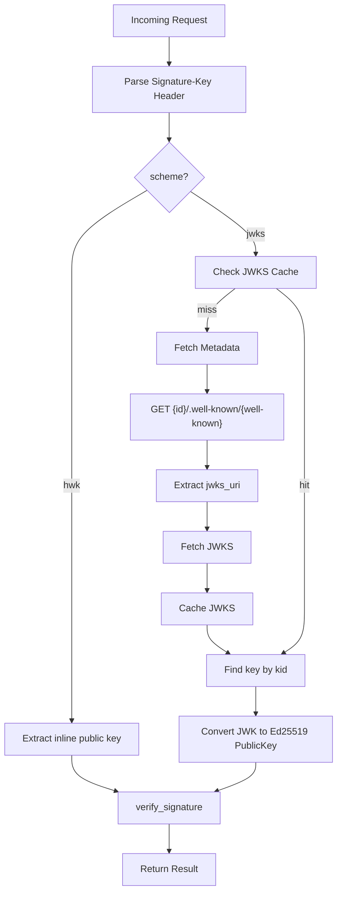

# Implement AAuth JWKS Support

## Overview

Add JWKS scheme support to AAuth signature verification. When a request arrives with `scheme=jwks`, the gateway will:
1. Fetch agent metadata from `{id}/.well-known/{well-known}` (defaults to `aauth-agent`)
2. Extract `jwks_uri` from metadata
3. Fetch JWKS from that URI
4. Find the key by `kid` and verify the signature

## Architecture



## Key Files to Modify

- [crates/agentgateway/src/http/aauth.rs](crates/agentgateway/src/http/aauth.rs) - Main changes: add JWKS cache, fetching, and resolver
- [crates/aauth/src/keys/mod.rs](crates/aauth/src/keys/mod.rs) - Export JWK-to-PublicKey conversion function
- [crates/aauth/src/keys/jwk.rs](crates/aauth/src/keys/jwk.rs) - Add helper to convert JWK to Ed25519 PublicKey

## Implementation Details

### 1. Add JWK to Ed25519 PublicKey Conversion (aauth crate)

In [crates/aauth/src/keys/jwk.rs](crates/aauth/src/keys/jwk.rs), add:

```rust
use crate::keys::ed25519::{PublicKey, public_key_from_bytes};

impl JWK {
    /// Convert OKP/Ed25519 JWK to PublicKey
    pub fn to_ed25519_public_key(&self) -> Result<PublicKey, AAuthError> {
        if self.kty != "OKP" {
            return Err(AAuthError::InvalidKey(format!("expected OKP, got {}", self.kty)));
        }
        let crv = self.crv.as_ref().ok_or_else(|| AAuthError::InvalidKey("missing crv".into()))?;
        if crv != "Ed25519" {
            return Err(AAuthError::InvalidKey(format!("expected Ed25519, got {}", crv)));
        }
        let x = self.x.as_ref().ok_or_else(|| AAuthError::InvalidKey("missing x".into()))?;
        public_key_from_bytes(x)
    }
}
```

### 2. Add JWKS Types and Cache (agentgateway)

In [crates/agentgateway/src/http/aauth.rs](crates/agentgateway/src/http/aauth.rs), add:

```rust
use std::sync::Arc;
use parking_lot::RwLock;
use std::time::{Duration, Instant};

/// Cached JWKS keyed by agent id
#[derive(Clone, Default)]
pub struct JwksCache {
    inner: Arc<RwLock<HashMap<String, CachedJwks>>>,
}

struct CachedJwks {
    keys: HashMap<String, aauth::keys::jwk::JWK>,  // kid -> JWK
    fetched_at: Instant,
}

/// Agent metadata response from /.well-known/aauth-agent
#[derive(Deserialize)]
struct AgentMetadata {
    jwks_uri: String,
    // agent: String,  // optional
}

/// JWKS response
#[derive(Deserialize)]
struct JwksResponse {
    keys: Vec<aauth::keys::jwk::JWK>,
}
```

### 3. Add JWKS Fetching Logic

Add methods to `AAuth` or as free functions:

```rust
impl AAuth {
    /// Fetch JWKS for an agent, using cache if available
    async fn get_jwks_key(
        &self,
        client: &Client,
        id: &str,
        kid: &str,
        well_known: Option<&str>,
    ) -> Result<aauth::keys::jwk::JWK, AAuthPolicyError> {
        // 1. Check cache
        if let Some(jwk) = self.jwks_cache.get(id, kid) {
            return Ok(jwk);
        }
        
        // 2. Build metadata URL: {id}/.well-known/{well_known}
        let well_known = well_known.unwrap_or("aauth-agent");
        let metadata_url = format!("{}/.well-known/{}", id.trim_end_matches('/'), well_known);
        
        // 3. Fetch metadata
        let metadata: AgentMetadata = fetch_json(client, &metadata_url).await
            .map_err(|e| AAuthPolicyError::VerificationFailed(format!("fetch metadata: {}", e)))?;
        
        // 4. Fetch JWKS from jwks_uri
        let jwks: JwksResponse = fetch_json(client, &metadata.jwks_uri).await
            .map_err(|e| AAuthPolicyError::VerificationFailed(format!("fetch jwks: {}", e)))?;
        
        // 5. Cache and find key by kid
        self.jwks_cache.insert(id, &jwks.keys);
        self.jwks_cache.get(id, kid)
            .ok_or_else(|| AAuthPolicyError::VerificationFailed(format!("key {} not found in JWKS", kid)))
    }
}

async fn fetch_json<T: DeserializeOwned>(client: &Client, url: &str) -> Result<T, anyhow::Error> {
    let req = http::Request::builder()
        .uri(url)
        .body(Body::empty())?;
    let resp = client.simple_call(req).await?;
    // Parse response body as JSON
    let body = hyper::body::to_bytes(resp.into_body()).await?;
    Ok(serde_json::from_slice(&body)?)
}
```

### 4. Update AAuth Struct

Modify `AAuth` to hold the cache and client:

```rust
#[derive(Clone)]
pub struct AAuth {
    mode: Mode,
    required_scheme: RequiredScheme,
    timestamp_tolerance: u64,
    challenge_config: Option<ChallengeConfig>,
    jwks_cache: JwksCache,
    client: Client,  // For JWKS fetching
}
```

Update `LocalAAuthConfig::try_into` to pass the client:

```rust
impl LocalAAuthConfig {
    pub async fn try_into(self, client: Client) -> Result<AAuth, AAuthPolicyError> {
        // ... existing code ...
        Ok(AAuth::new(
            self.mode,
            required_scheme,
            self.timestamp_tolerance,
            challenge_config,
            JwksCache::default(),
            client,
        ))
    }
}
```

### 5. Update the Resolver in apply()

The key change is in `AAuth::apply()`. Since the resolver must be sync but JWKS fetching is async, pre-fetch the key before calling `verify_signature`:

```rust
pub async fn apply(&self, _log: Option<&mut RequestLog>, req: &mut Request) -> Result<(), AAuthPolicyError> {
    // ... existing header extraction code ...

    // Pre-parse signature-key to determine scheme
    let sig_key_str = sig_key_header.unwrap();
    let parsed_sig_key = aauth::headers::parse_signature_key(sig_key_str)
        .map_err(|e| AAuthPolicyError::VerificationFailed(e.to_string()))?;

    // Pre-fetch JWKS key if needed
    let prefetched_key: Option<aauth::keys::ed25519::PublicKey> = 
        if parsed_sig_key.scheme == "jwks" {
            let id = parsed_sig_key.params.get("id")
                .ok_or_else(|| AAuthPolicyError::VerificationFailed("jwks: missing id".into()))?;
            let kid = parsed_sig_key.params.get("kid")
                .ok_or_else(|| AAuthPolicyError::VerificationFailed("jwks: missing kid".into()))?;
            let well_known = parsed_sig_key.params.get("well-known").map(|s| s.as_str());
            
            let jwk = self.get_jwks_key(&self.client, id, kid, well_known).await?;
            Some(jwk.to_ed25519_public_key()
                .map_err(|e| AAuthPolicyError::VerificationFailed(e.to_string()))?)
        } else {
            None
        };

    // Resolver that handles both hwk and jwks
    let resolver = |sig_key: &SignatureKey| -> Result<aauth::keys::ed25519::PublicKey, LibAAuthError> {
        match sig_key.scheme.as_str() {
            "hwk" => resolve_hwk_public_key(sig_key),
            "jwks" => prefetched_key.clone()
                .ok_or_else(|| LibAAuthError::JwksFetchError("key not pre-fetched".into())),
            s => Err(LibAAuthError::UnsupportedScheme(s.to_string())),
        }
    };

    let verify_result = verify_signature(/* ... */, &resolver).await
        .map_err(|e| AAuthPolicyError::VerificationFailed(e.to_string()))?;
    
    // ... rest of method ...
}
```

### 6. Add Tests

Add tests in [crates/agentgateway/src/http/aauth_tests.rs](crates/agentgateway/src/http/aauth_tests.rs):

- Test JWKS cache hit/miss
- Test metadata fetching (mock HTTP responses)
- Test key lookup by kid
- Test end-to-end jwks verification with pre-signed request

## Configuration

No config changes needed. The existing `requiredScheme: jwks` will now work:

```yaml
policies:
  - aauth:
      mode: strict
      requiredScheme: jwks
      timestampTolerance: 60
```

## Error Handling

New error scenarios to handle:
- Metadata URL unreachable
- Invalid metadata JSON (missing jwks_uri)
- JWKS URL unreachable  
- Key not found by kid
- Key is not OKP/Ed25519

All errors map to `AAuthPolicyError::VerificationFailed` with descriptive messages.

## Cache Considerations

- **TTL**: Default 5 minutes (configurable later)
- **Eviction**: LRU or time-based
- **Scope**: Per-AAuth instance (shared across requests to same listener)
- **Thread Safety**: Use `parking_lot::RwLock` for concurrent access
