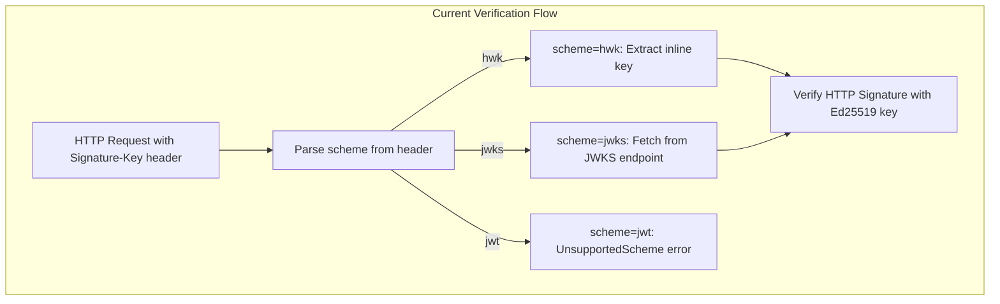
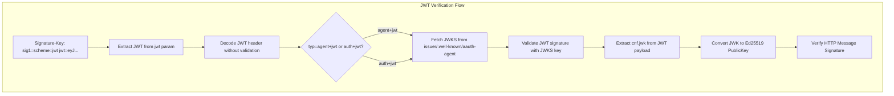

# JWT HTTPSig Implementation Plan

## Overview

The current aauth implementation supports `hwk` (inline key) and `jwks` (JWKS discovery) schemes, but returns `UnsupportedScheme` for `jwt`. This plan adds full JWT HTTPSig support by:

1. Validating JWT tokens (agent+jwt and auth+jwt types)
2. Extracting the `cnf.jwk` claim containing the Ed25519 public key
3. Using that key for HTTP message signature verification

## Current Architecture



## Proposed JWT Flow



## Implementation Details

### 1. Add jsonwebtoken to aauth crate

File: [crates/aauth/Cargo.toml](crates/aauth/Cargo.toml)

Add `jsonwebtoken` dependency to enable JWT parsing and validation:

```toml
jsonwebtoken = { version = "10.0", features = ["aws_lc_rs"] }
```

### 2. Implement agent token validation

File: [crates/aauth/src/tokens/agent_token.rs](crates/aauth/src/tokens/agent_token.rs)

Replace placeholder with real implementation:

- `validate_agent_token(jwt, jwks_fetcher)` - Validates agent+jwt tokens
  - Decode header, verify `typ="agent+jwt"` or `typ="at+jwt"`
  - Extract `kid` and `iss` from header/claims
  - Fetch JWKS from `{iss}/.well-known/aauth-agent`
  - Validate JWT signature with EdDSA algorithm
  - Return `(iss, sub)` as agent identity

- `extract_agent_token_key(jwt)` - Extracts `cnf.jwk` from validated JWT
  - Parse JWT payload (already validated)
  - Extract `cnf.jwk` claim
  - Parse as `JWK` struct

### 3. Implement auth token validation

File: [crates/aauth/src/tokens/auth_token.rs](crates/aauth/src/tokens/auth_token.rs)

Similar pattern for auth+jwt tokens:

- `validate_auth_token(jwt, jwks_fetcher)` - Validates auth+jwt tokens
  - Decode header, verify `typ="auth+jwt"`
  - Fetch JWKS from auth server (issuer)
  - Validate JWT signature
  - Return `(agent, sub, scope)` from claims

- `extract_auth_token_key(jwt)` - Extracts `cnf.jwk` from validated JWT

### 4. Create JWT validation utilities

New file: `crates/aauth/src/tokens/validation.rs`

Shared utilities for JWT validation:

```rust
pub struct JwtValidationConfig {
    pub timestamp_tolerance: u64,
    pub required_typ: Option<String>,
}

pub async fn validate_jwt_with_jwks<F, Fut>(
    jwt: &str,
    jwks_fetcher: F,
    config: &JwtValidationConfig,
) -> Result<Claims, AAuthError>
where
    F: Fn(&str) -> Fut,
    Fut: Future<Output = Result<JwkSet, AAuthError>>;

pub fn extract_cnf_jwk(claims: &Claims) -> Result<JWK, AAuthError>;
```

### 5. Update resolver in agentgateway

File: [crates/agentgateway/src/http/aauth.rs](crates/agentgateway/src/http/aauth.rs)

Add JWT scheme handling to the resolver (around line 504):

```rust
let resolver = move |sig_key: &SignatureKey| -> Result<PublicKey, AAuthError> {
    match sig_key.scheme.as_str() {
        "hwk" => resolve_hwk_public_key(sig_key),
        "jwks" => prefetched_key.ok_or(...),
        "jwt" => {
            // Extract JWT from params
            let jwt = sig_key.params.get("jwt")
                .ok_or(AAuthError::InvalidHeader("missing jwt param"))?;
            // JWT was pre-validated, extract cnf.jwk
            prefetched_jwt_key.ok_or(...)
        },
        s => Err(AAuthError::UnsupportedScheme(s.to_string())),
    }
};
```

### 6. Add JWT pre-validation in apply method

Before verification, pre-validate JWT and extract key (similar to JWKS pre-fetch):

```rust
// In AAuth::apply(), around line 419
let prefetched_jwt_key = if scheme == "jwt" {
    let jwt = sig_key.params.get("jwt")?;
    let header = decode_header(jwt)?;
    let typ = header.typ.as_deref();
    
    // Determine issuer and fetch JWKS
    let claims = decode_claims_unverified(jwt)?;
    let iss = claims.get("iss")?;
    let jwks = self.get_jwks_key(iss, header.kid?, Some("aauth-agent")).await?;
    
    // Validate JWT
    let validated = validate_jwt(jwt, &jwks)?;
    
    // Extract cnf.jwk
    let cnf_jwk = extract_cnf_jwk(&validated.claims)?;
    Some(cnf_jwk.to_ed25519_public_key()?)
} else {
    None
};
```

### 7. Update VerificationResult with JWT claims

File: [crates/aauth/src/signing/verifier.rs](crates/aauth/src/signing/verifier.rs)

The `VerificationResult` struct already has fields for JWT data:

```rust
pub struct VerificationResult {
    pub valid: bool,
    pub scheme: SignatureScheme,
    pub agent_id: Option<String>,       // iss from JWT
    pub agent_delegate: Option<String>, // sub from agent+jwt
    pub claims: Option<Map<String, Value>>, // Full JWT claims
}
```

Populate these fields when jwt scheme is used.

### 8. Add cnf claim struct

File: `crates/aauth/src/tokens/mod.rs`

```rust
#[derive(Debug, Deserialize)]
pub struct CnfClaim {
    pub jwk: JWK,
}
```

## Key Code Reuse

- **JWKS fetching**: Reuse existing `get_jwks_key` method and `JwksCache`
- **JWK to Ed25519**: Use existing `JWK::to_ed25519_public_key()` in `crates/aauth/src/keys/jwk.rs`
- **jsonwebtoken library**: Already used in `crates/agentgateway/src/http/jwt.rs`, add EdDSA support pattern

## Files Changed

| File | Change |
|------|--------|
| `crates/aauth/Cargo.toml` | Add jsonwebtoken dependency |
| `crates/aauth/src/tokens/agent_token.rs` | Implement validate/extract functions |
| `crates/aauth/src/tokens/auth_token.rs` | Implement validate/extract functions |
| `crates/aauth/src/tokens/mod.rs` | Add CnfClaim struct, re-exports |
| `crates/aauth/src/tokens/validation.rs` | New - shared JWT validation utilities |
| `crates/agentgateway/src/http/aauth.rs` | Add JWT resolver + pre-validation |

## Test Strategy

- Unit tests for JWT parsing and cnf.jwk extraction
- Integration tests using test vectors from `aauth-rust/aauth-test-vectors.json`
- End-to-end test with signed request using jwt scheme
